

# Slide Design Prompts

Free presentation design systems you paste into ChatGPT or Claude.

[**Browse all prompts**](prompts/README.md) &nbsp;·&nbsp; [**Live site**](https://slidespeak.co/slide-design-prompts)

---

## What this is

AI chat tools write decent slide content. Design is where they fall apart: clip-art, clashing colors, bullet walls. A sharper prompt fixes that.

Each theme here is **one prompt** that carries a full design system: a color palette pinned to hex values, named Google Fonts, a layout grammar, and an avoid-list that stops the model from decorating. Paste it into ChatGPT or Claude, say what your talk covers, and every slide matches.

**67 themes** across **7 use-case categories** and **9 visual styles**.

## How to use

1. **Find a theme below** and open its page. Each has the full prompt, a palette, fonts, and slide previews.
2. **Copy the prompt** (or grab the theme's `PROMPT.md`) and paste it into a new ChatGPT or Claude chat. Answer the one question it asks, then generate and refine slide by slide.
3. **Or generate a finished deck with [SlideSpeak](https://app.slidespeak.co/presentation?utm_source=github&utm_medium=referral&utm_campaign=slide-design-prompts).** The same themes power SlideSpeak's generator, which exports to PowerPoint and Google Slides.

Every prompt pins colors and fonts as values you can edit. Swap the hex codes for your brand colors before you send it, and the layout rules still hold.

## What's in a theme

Each theme is a self-contained folder under [`prompts/`](prompts/README.md):

| File | What it holds |
| --- | --- |
| `README.md` | The theme page: preview thumbnails, the prompt, palette, fonts, and notes on what it's for. |
| `PROMPT.md` | Just the prompt, ready to paste into a chat. |
| `previews/*.webp` | Rendered previews of each example slide. |

## Gallery

Pick by what the deck is for. Click any theme for its full prompt, palette, fonts, and previews — or scan the [plain index](prompts/README.md).

### Pitch decks

Themes that help you raise money. Dark backgrounds, big numbers, and layouts that put your traction front and center.

<table>
  <tr>
    <td align="center" width="33%" valign="top">
       
      <a href="prompts/aurora/"><b>Aurora</b></a> 
      Gradient pitch deck for SaaS 
      <i>Bold · Tech</i>
    </td>
    <td align="center" width="33%" valign="top">
       
      <a href="prompts/demo-day/"><b>Demo Day</b></a> 
      Three minutes, one idea per slide 
      <i>Bold · Minimal</i>
    </td>
    <td align="center" width="33%" valign="top">
      <a href="prompts/hearth/">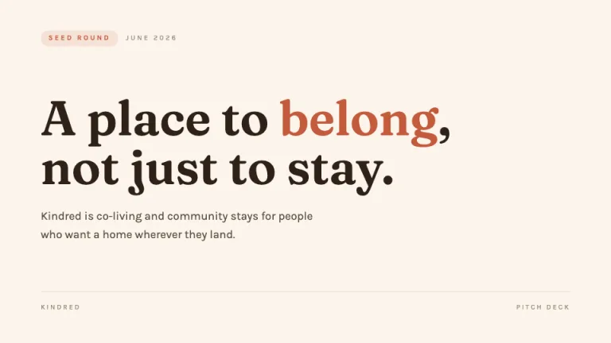</a> 
      <a href="prompts/hearth/"><b>Hearth</b></a> 
      Warm, story-led brand pitch 
      <i>Warm · Minimal</i>
    </td>
  </tr>
  <tr>
    <td align="center" width="33%" valign="top">
       
      <a href="prompts/holo/"><b>Holo</b></a> 
      Iridescent, but disciplined 
      <i>Playful · Calm</i>
    </td>
    <td align="center" width="33%" valign="top">
       
      <a href="prompts/midnight-pitch/"><b>Midnight Pitch</b></a> 
      Make investors lean in 
      <i>Dark · Bold</i>
    </td>
    <td align="center" width="33%" valign="top">
       
      <a href="prompts/monolith/"><b>Monolith</b></a> 
      Expensive silence 
      <i>Minimal · Dark</i>
    </td>
  </tr>
  <tr>
    <td align="center" width="33%" valign="top">
      <a href="prompts/runway/">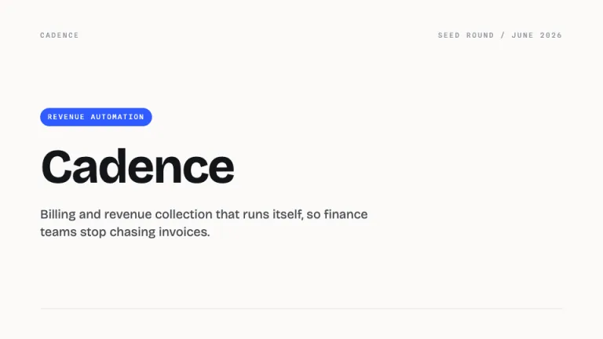</a> 
      <a href="prompts/runway/"><b>Runway</b></a> 
      Clean, light investor pitch deck 
      <i>Minimal · Corporate</i>
    </td>
    <td align="center" width="33%" valign="top">
      <a href="prompts/spark/">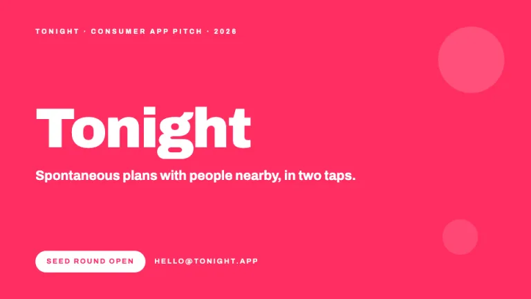</a> 
      <a href="prompts/spark/"><b>Spark</b></a> 
      Bold pink pitch for consumer apps 
      <i>Bold · Playful</i>
    </td>
    <td align="center" width="33%" valign="top">
      <a href="prompts/term-sheet/">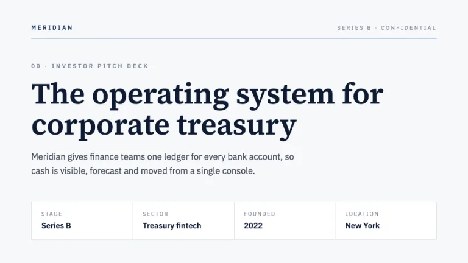</a> 
      <a href="prompts/term-sheet/"><b>Term Sheet</b></a> 
      The institutional VC framework deck 
      <i>Corporate · Minimal</i>
    </td>
  </tr>
  <tr>
    <td align="center" width="33%" valign="top">
      <a href="prompts/traction/">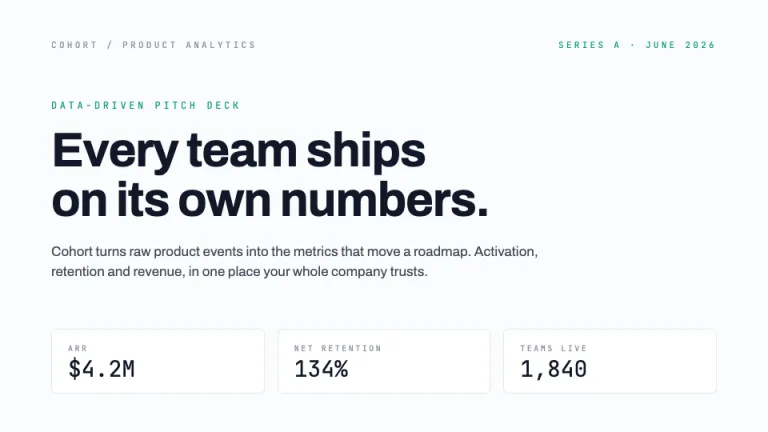</a> 
      <a href="prompts/traction/"><b>Traction</b></a> 
      Let the numbers pitch 
      <i>Minimal · Tech</i>
    </td>
  </tr>
</table>

### Business & strategy

Clean themes for quarterly reviews, strategy decks and operating plans. No clutter, just slides that hold up in a boardroom.

<table>
  <tr>
    <td align="center" width="33%" valign="top">
       
      <a href="prompts/atlas/"><b>Atlas</b></a> 
      The dependable one 
      <i>Corporate · Minimal</i>
    </td>
    <td align="center" width="33%" valign="top">
       
      <a href="prompts/benchmark/"><b>Benchmark</b></a> 
      Us versus the field 
      <i>Corporate · Minimal</i>
    </td>
    <td align="center" width="33%" valign="top">
       
      <a href="prompts/boardroom/"><b>Boardroom</b></a> 
      The slide is the argument 
      <i>Corporate · Minimal</i>
    </td>
  </tr>
  <tr>
    <td align="center" width="33%" valign="top">
       
      <a href="prompts/chevron/"><b>Chevron</b></a> 
      Four phases, one direction 
      <i>Corporate · Bold</i>
    </td>
    <td align="center" width="33%" valign="top">
       
      <a href="prompts/harvey/"><b>Harvey</b></a> 
      Maturity in quarter turns 
      <i>Corporate · Minimal</i>
    </td>
    <td align="center" width="33%" valign="top">
       
      <a href="prompts/memo/"><b>Memo</b></a> 
      Per my last memo 
      <i>Minimal · Corporate</i>
    </td>
  </tr>
  <tr>
    <td align="center" width="33%" valign="top">
       
      <a href="prompts/metro/"><b>Metro</b></a> 
      Mind the gap analysis 
      <i>Playful · Minimal</i>
    </td>
    <td align="center" width="33%" valign="top">
       
      <a href="prompts/operator/"><b>Operator</b></a> 
      Status, not stories 
      <i>Corporate · Tech</i>
    </td>
    <td align="center" width="33%" valign="top">
       
      <a href="prompts/whiteboard/"><b>Whiteboard</b></a> 
      Fresh from the workshop 
      <i>Playful · Warm</i>
    </td>
  </tr>
</table>

### Marketing & brand

Themes with personality for campaign plans, brand decks and creative reviews.

<table>
  <tr>
    <td align="center" width="33%" valign="top">
       
      <a href="prompts/billboard/"><b>Billboard</b></a> 
      One color, one line 
      <i>Bold · Playful</i>
    </td>
    <td align="center" width="33%" valign="top">
       
      <a href="prompts/bubblegum/"><b>Bubblegum</b></a> 
      Y2K sparkle with a system 
      <i>Playful · Bold</i>
    </td>
    <td align="center" width="33%" valign="top">
       
      <a href="prompts/memphis/"><b>Memphis</b></a> 
      Serious work, unserious style 
      <i>Playful · Bold</i>
    </td>
  </tr>
  <tr>
    <td align="center" width="33%" valign="top">
       
      <a href="prompts/outrun/"><b>Outrun</b></a> 
      Straight out of 1986 
      <i>Playful · Dark</i>
    </td>
    <td align="center" width="33%" valign="top">
       
      <a href="prompts/polaroid/"><b>Polaroid</b></a> 
      Pinned to the wall 
      <i>Warm · Playful</i>
    </td>
    <td align="center" width="33%" valign="top">
      <a href="prompts/sorbet/">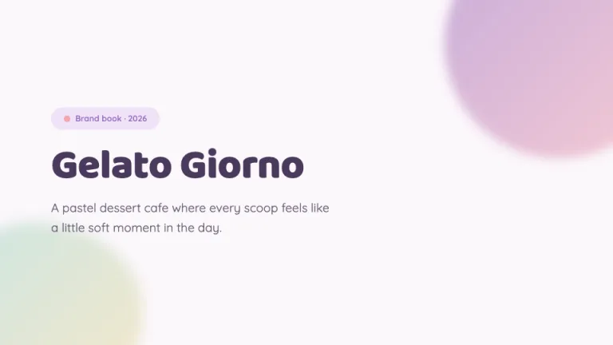</a> 
      <a href="prompts/sorbet/"><b>Sorbet</b></a> 
      Soft pastels, kept tasteful 
      <i>Playful · Calm</i>
    </td>
  </tr>
</table>

### Tech & product

Modern themes for product roadmaps, feature launches and engineering reviews.

<table>
  <tr>
    <td align="center" width="33%" valign="top">
       
      <a href="prompts/arcade/"><b>Arcade</b></a> 
      Insert coin 
      <i>Playful · Dark</i>
    </td>
    <td align="center" width="33%" valign="top">
       
      <a href="prompts/circuit/"><b>Circuit</b></a> 
      Follow the traces 
      <i>Tech · Dark</i>
    </td>
    <td align="center" width="33%" valign="top">
       
      <a href="prompts/drafting-room/"><b>Drafting Room</b></a> 
      Measure twice, present once 
      <i>Tech · Minimal</i>
    </td>
  </tr>
  <tr>
    <td align="center" width="33%" valign="top">
       
      <a href="prompts/mainframe/"><b>Mainframe</b></a> 
      Straight from the machine room 
      <i>Tech · Dark</i>
    </td>
    <td align="center" width="33%" valign="top">
       
      <a href="prompts/telemetry/"><b>Telemetry</b></a> 
      Your deck as a dashboard 
      <i>Tech · Dark</i>
    </td>
    <td align="center" width="33%" valign="top">
       
      <a href="prompts/wireframe/"><b>Wireframe</b></a> 
      Shipped before the visual design 
      <i>Minimal · Tech</i>
    </td>
  </tr>
</table>

### Creative & portfolio

Typography-led themes for portfolios, studios and personal work.

<table>
  <tr>
    <td align="center" width="33%" valign="top">
      <a href="prompts/atelier/">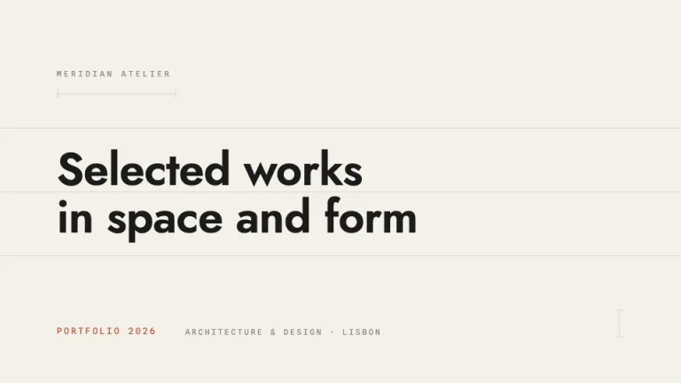</a> 
      <a href="prompts/atelier/"><b>Atelier</b></a> 
      Built like a blueprint 
      <i>Minimal · Elegant</i>
    </td>
    <td align="center" width="33%" valign="top">
       
      <a href="prompts/basel/"><b>Basel</b></a> 
      Loud type, nothing else 
      <i>Bold · Minimal</i>
    </td>
    <td align="center" width="33%" valign="top">
       
      <a href="prompts/cinema/"><b>Cinema</b></a> 
      Quiet on set 
      <i>Elegant · Dark</i>
    </td>
  </tr>
  <tr>
    <td align="center" width="33%" valign="top">
       
      <a href="prompts/collage/"><b>Collage</b></a> 
      Scissors first, layout second 
      <i>Playful · Warm</i>
    </td>
    <td align="center" width="33%" valign="top">
      <a href="prompts/coquette/">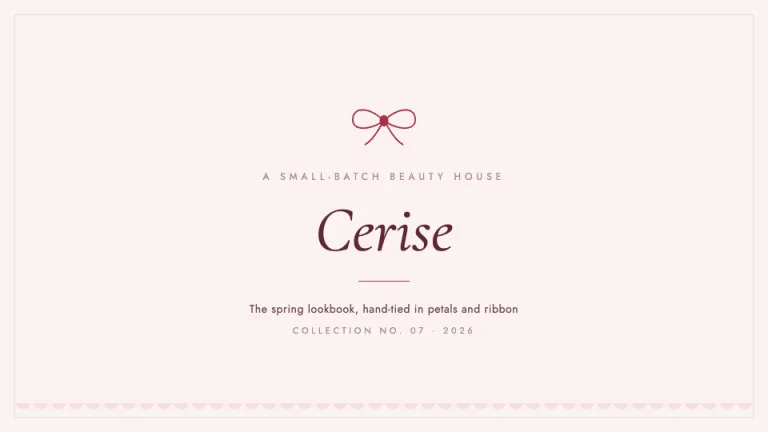</a> 
      <a href="prompts/coquette/"><b>Coquette</b></a> 
      Ribbons, blush and a cherry kiss 
      <i>Elegant · Playful</i>
    </td>
    <td align="center" width="33%" valign="top">
      <a href="prompts/dark-academia/">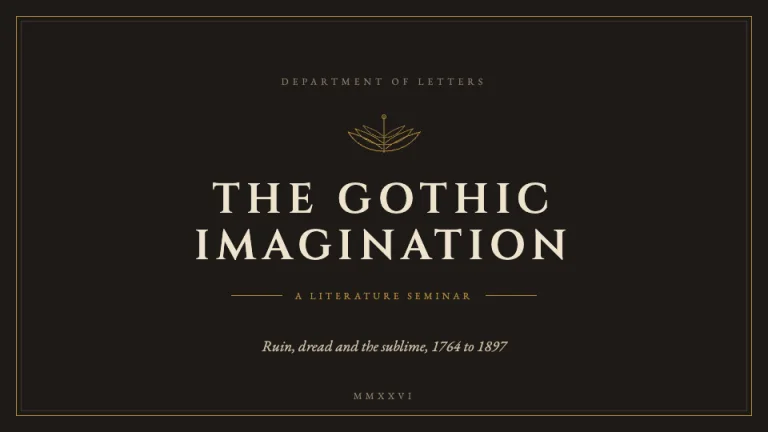</a> 
      <a href="prompts/dark-academia/"><b>Dark Academia</b></a> 
      Candlelit library, rare-books society 
      <i>Elegant · Dark</i>
    </td>
  </tr>
  <tr>
    <td align="center" width="33%" valign="top">
      <a href="prompts/logline/">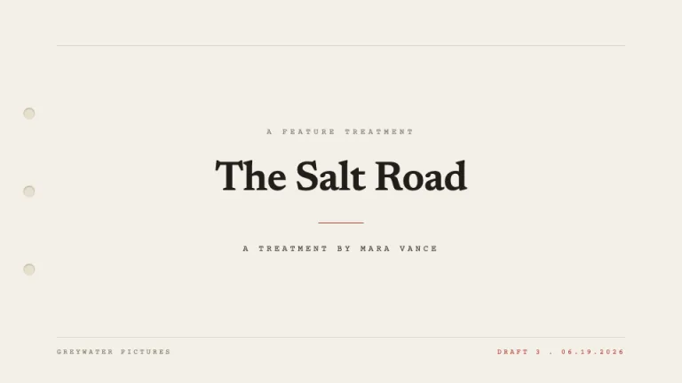</a> 
      <a href="prompts/logline/"><b>Logline</b></a> 
      The pitch in one page 
      <i>Minimal · Elegant</i>
    </td>
    <td align="center" width="33%" valign="top">
       
      <a href="prompts/lookbook/"><b>Lookbook</b></a> 
      Mood, tone and frame 
      <i>Elegant · Dark</i>
    </td>
    <td align="center" width="33%" valign="top">
       
      <a href="prompts/manuscript/"><b>Manuscript</b></a> 
      Slides before print 
      <i>Elegant · Warm</i>
    </td>
  </tr>
  <tr>
    <td align="center" width="33%" valign="top">
       
      <a href="prompts/marquee/"><b>Marquee</b></a> 
      Make it an occasion 
      <i>Elegant · Dark</i>
    </td>
    <td align="center" width="33%" valign="top">
      <a href="prompts/oat/">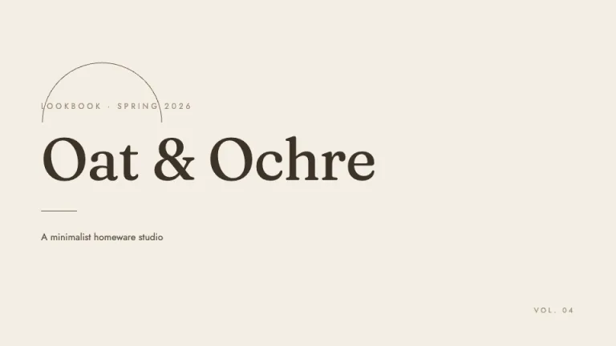</a> 
      <a href="prompts/oat/"><b>Oat</b></a> 
      Warm neutrals, quiet arches, expensive calm 
      <i>Minimal · Calm</i>
    </td>
    <td align="center" width="33%" valign="top">
      <a href="prompts/one-sheet/">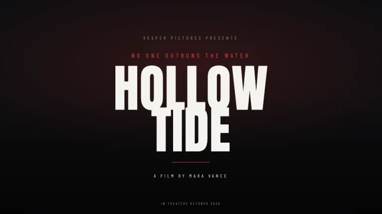</a> 
      <a href="prompts/one-sheet/"><b>One Sheet</b></a> 
      Top of the billing 
      <i>Bold · Dark</i>
    </td>
  </tr>
  <tr>
    <td align="center" width="33%" valign="top">
       
      <a href="prompts/origami/"><b>Origami</b></a> 
      Folded, not decorated 
      <i>Minimal · Calm</i>
    </td>
    <td align="center" width="33%" valign="top">
      <a href="prompts/passepartout/">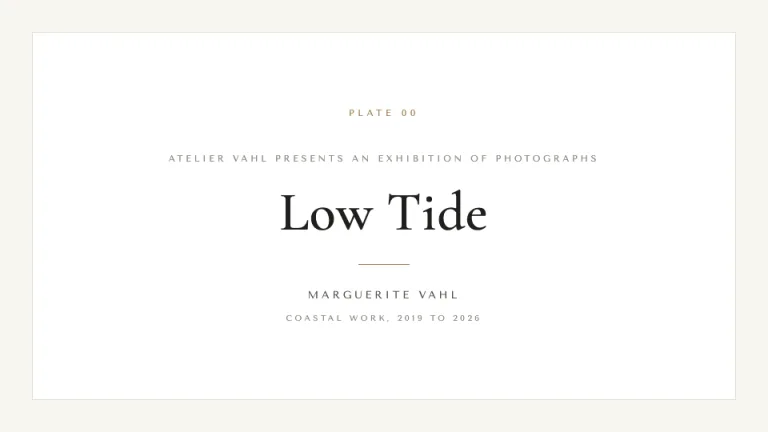</a> 
      <a href="prompts/passepartout/"><b>Passepartout</b></a> 
      A gallery on every slide 
      <i>Elegant · Calm</i>
    </td>
  </tr>
</table>

### Education & research

Easy-to-read themes for lectures, research and reports. Built so people can actually follow along.

<table>
  <tr>
    <td align="center" width="33%" valign="top">
       
      <a href="prompts/atrium/"><b>Atrium</b></a> 
      Calm, like a courtyard 
      <i>Calm · Warm</i>
    </td>
    <td align="center" width="33%" valign="top">
       
      <a href="prompts/chalkboard/"><b>Chalkboard</b></a> 
      Drawn up at halftime 
      <i>Playful · Dark</i>
    </td>
    <td align="center" width="33%" valign="top">
       
      <a href="prompts/expedition/"><b>Expedition</b></a> 
      Here be agenda items 
      <i>Warm · Elegant</i>
    </td>
  </tr>
  <tr>
    <td align="center" width="33%" valign="top">
       
      <a href="prompts/field-notes/"><b>Field Notes</b></a> 
      Taped to the folder 
      <i>Warm · Minimal</i>
    </td>
    <td align="center" width="33%" valign="top">
       
      <a href="prompts/herbarium/"><b>Herbarium</b></a> 
      Pressed, labeled, filed 
      <i>Calm · Elegant</i>
    </td>
    <td align="center" width="33%" valign="top">
       
      <a href="prompts/level-up/"><b>Level Up</b></a> 
      Earn the XP 
      <i>Playful · Tech</i>
    </td>
  </tr>
  <tr>
    <td align="center" width="33%" valign="top">
       
      <a href="prompts/notebook/"><b>Notebook</b></a> 
      Margins included 
      <i>Playful · Warm</i>
    </td>
    <td align="center" width="33%" valign="top">
       
      <a href="prompts/observatory/"><b>Observatory</b></a> 
      Data as constellations 
      <i>Calm · Dark</i>
    </td>
    <td align="center" width="33%" valign="top">
       
      <a href="prompts/quiz-night/"><b>Quiz Night</b></a> 
      Training, but with buzzers 
      <i>Playful · Bold</i>
    </td>
  </tr>
  <tr>
    <td align="center" width="33%" valign="top">
       
      <a href="prompts/seminar/"><b>Seminar</b></a> 
      Beamer, but nicer 
      <i>Minimal · Corporate</i>
    </td>
    <td align="center" width="33%" valign="top">
       
      <a href="prompts/syllabus/"><b>Syllabus</b></a> 
      The outline is the design 
      <i>Calm · Playful</i>
    </td>
    <td align="center" width="33%" valign="top">
       
      <a href="prompts/trailhead/"><b>Trailhead</b></a> 
      Learning, one mile at a time 
      <i>Warm · Calm</i>
    </td>
  </tr>
  <tr>
    <td align="center" width="33%" valign="top">
       
      <a href="prompts/varsity/"><b>Varsity</b></a> 
      Wear the colors 
      <i>Bold · Warm</i>
    </td>
    <td align="center" width="33%" valign="top">
      <a href="prompts/wildflower/">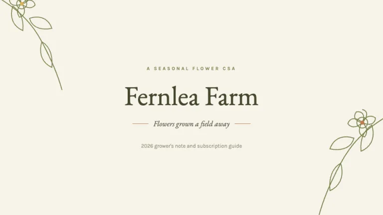</a> 
      <a href="prompts/wildflower/"><b>Wildflower</b></a> 
      Hand-gathered, loosely arranged 
      <i>Warm · Calm</i>
    </td>
  </tr>
</table>

### Finance & consulting

Understated themes for fund updates, board reports and advisory work.

<table>
  <tr>
    <td align="center" width="33%" valign="top">
       
      <a href="prompts/bcg-style/"><b>BCG Style</b></a> 
      Strategy lives in a 2x2 
      <i>Corporate · Bold</i>
    </td>
    <td align="center" width="33%" valign="top">
       
      <a href="prompts/broadsheet/"><b>Broadsheet</b></a> 
      Read all about it 
      <i>Elegant · Corporate</i>
    </td>
    <td align="center" width="33%" valign="top">
       
      <a href="prompts/deloitte-style/"><b>Deloitte Style</b></a> 
      Black, white and one green dot 
      <i>Corporate · Bold</i>
    </td>
  </tr>
  <tr>
    <td align="center" width="33%" valign="top">
       
      <a href="prompts/ledger/"><b>Ledger</b></a> 
      Every number reconciled 
      <i>Elegant · Calm</i>
    </td>
    <td align="center" width="33%" valign="top">
       
      <a href="prompts/letterhead/"><b>Letterhead</b></a> 
      Engraved, not printed 
      <i>Elegant · Minimal</i>
    </td>
    <td align="center" width="33%" valign="top">
       
      <a href="prompts/mckinsey-style/"><b>McKinsey Style</b></a> 
      Answer first, always 
      <i>Corporate · Minimal</i>
    </td>
  </tr>
  <tr>
    <td align="center" width="33%" valign="top">
       
      <a href="prompts/pwc-style/"><b>PwC Style</b></a> 
      Serif headlines, five warm colors 
      <i>Corporate · Warm</i>
    </td>
    <td align="center" width="33%" valign="top">
       
      <a href="prompts/ticker/"><b>Ticker</b></a> 
      Amber on black 
      <i>Tech · Dark</i>
    </td>
  </tr>
</table>

## Categories and styles

Themes sit on two axes. Categories say what a deck is for: pitch, business, marketing, tech, creative, education, finance. Styles say what it looks like: minimal, bold, elegant, playful, corporate, calm, warm, dark, tech. A theme can carry more than one style.

## Contributing

A theme is a folder with a prompt, a short page, and slide previews, so new themes and fixes are easy to send. See [CONTRIBUTING.md](CONTRIBUTING.md) for the format and the quality bar.

## License

[MIT](LICENSE). Use the prompts and previews for anything, commercial work included. Credit to SlideSpeak is optional but welcome.

The consulting-style themes (McKinsey Style, BCG Style, Deloitte Style, PwC Style) are **unofficial homages** built from publicly documented deck conventions. They are not affiliated with, endorsed by, or produced by those firms, and claim no rights to their trademarks.

## About SlideSpeak

[SlideSpeak](https://slidespeak.co) turns a prompt, document, or topic into a finished, on-brand deck and exports to PowerPoint and Google Slides. This collection is the open-source companion to our [Slide Design Prompts](https://slidespeak.co/slide-design-prompts) gallery.

Made by the team at <a href="https://slidespeak.co">SlideSpeak</a>.

