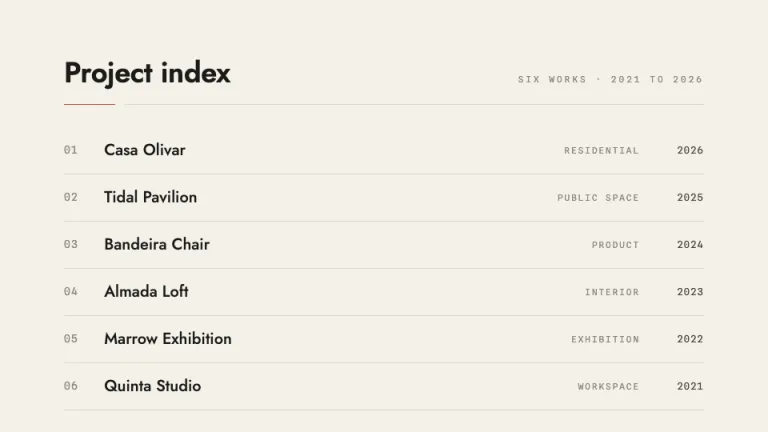
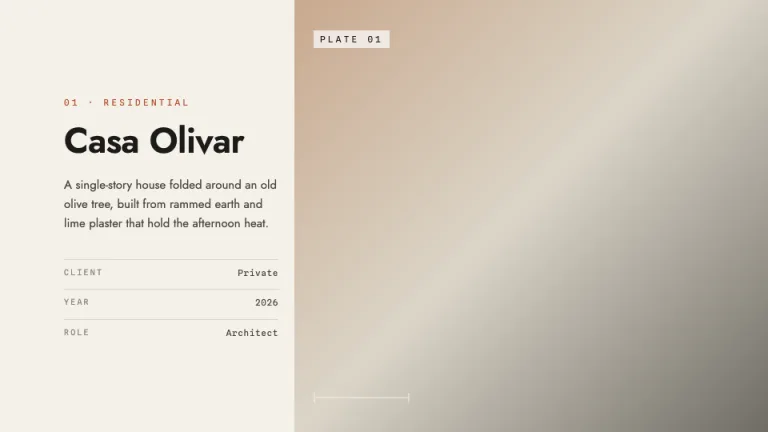
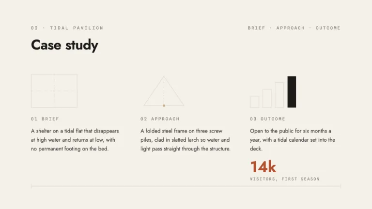
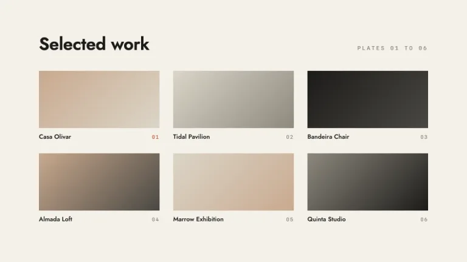
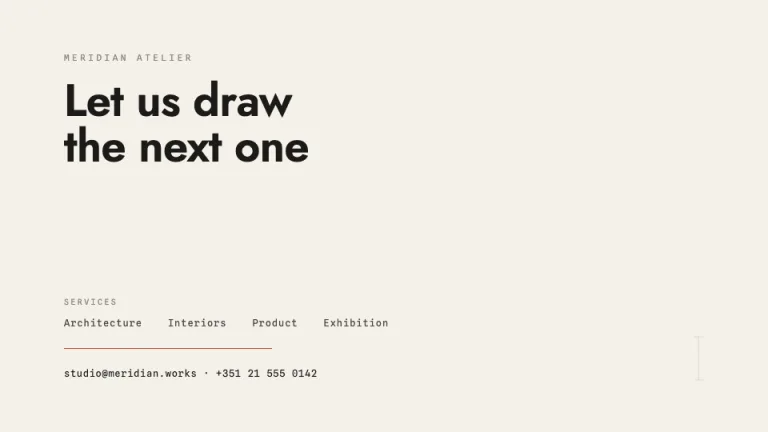

[← All prompts](../README.md) · [Live site](https://slidespeak.co/slide-design-prompts) · [SlideSpeak](https://slidespeak.co)

# Atelier

> Built like a blueprint

A warm-paper portfolio set on a drawing board, with wide margins, mono project numbers and one burnt-sienna accent. For work that earns trust through precision, not decoration.

**Category:** Creative & portfolio &nbsp;·&nbsp; **Style:** Minimal, Elegant &nbsp;·&nbsp; **Mode:** Light &nbsp;·&nbsp; **Fonts:** Jost + Spline Sans Mono

<table>
    <tr>
      <td align="center" width="33%"><br><sub>Cover</sub></td>
      <td align="center" width="33%"><br><sub>Project index</sub></td>
      <td align="center" width="33%"><br><sub>Project plate</sub></td>
    </tr>
    <tr>
      <td align="center" width="33%"><br><sub>Case study</sub></td>
      <td align="center" width="33%"><br><sub>Selected work</sub></td>
      <td align="center" width="33%"><br><sub>Contact</sub></td>
    </tr>
</table>

## The prompt

Copy the prompt below into **ChatGPT**, **Claude**, or any AI chat — or grab the raw [`PROMPT.md`](./PROMPT.md). It asks what your presentation is about first, then applies the design to every slide.

```text
Create a presentation in the 'Atelier' theme: a refined architecture and design case-study portfolio that looks like a project laid out on a drawing board, quiet and exact. Background: warm paper #F4F1EA on every slide, with white #FFFFFF only for tonal image plates. Typography: titles and headings in 'Jost' at 36 to 64px, weight 500 to 600, ink #1C1B19, tracking near -0.01em; body copy at 14 to 16px in #4A4843; and every small label, project number, plate caption, eyebrow, year and dimension tick label in 'Spline Sans Mono' at 10 to 12px, uppercase, letter-spaced 0.18em to 0.24em, in muted #8E897E. Both are Google Fonts. Layout grammar: generous wide margins, a strong left axis, content set on a baseline grid so type and rules line up. Number projects as plates, mono numerals 01 to 06 in a fixed column. Draw drafting dimension ticks as thin 1px #DBD5C8 lines capped with short perpendicular end ticks and a centered mono measurement label, used to underline a heading or span a margin. Image areas are tasteful tonal blocks built from CSS gradients or duotone fills in #C9A98E, #DBD5C8 and ink, never photographs, each carrying a small mono PLATE caption. Use terracotta #B4502E exactly once per slide as the single accent, a key stat, a short rule, a caption color or one filled tick, never twice. Thin 1px rules in #DBD5C8 separate sections. Strictly avoid: a second accent color, drop shadows, rounded cards, gradients used as decoration rather than image plates, clipart or icon fonts, stock photos, dense bullet lists, and cramped margins.

Use this theme for my slides. Ask me what the presentation is about first, then apply the theme to every slide.
```

**[Open ChatGPT ↗](https://chatgpt.com/)** &nbsp;·&nbsp; **[Open Claude ↗](https://claude.ai/new)** &nbsp;·&nbsp; **[Generate a finished deck with SlideSpeak ↗](https://app.slidespeak.co/presentation?utm_source=github&utm_medium=referral&utm_campaign=slide-design-prompts)**

## Palette

| Role | Hex |
| --- | --- |
| Background | `#F4F1EA` |
| Surface / panel | `#FFFFFF` |
| Border | `#DBD5C8` |
| Primary accent | `#B4502E` |
| Primary (soft tint) | `#F0E1D8` |
| Text on primary | `#FFFFFF` |
| Heading text | `#1C1B19` |
| Body text | `#4A4843` |
| Muted text | `#8E897E` |

**Chart series:** `#B4502E` `#1C1B19` `#C9A98E` `#DBD5C8`

## Fonts

- **Jost** (heading, Google Fonts)
- **Spline Sans Mono** (supporting, Google Fonts)

---

<sub>Part of [SlideSpeak Slide Design Prompts](../../README.md) · MIT licensed</sub>
