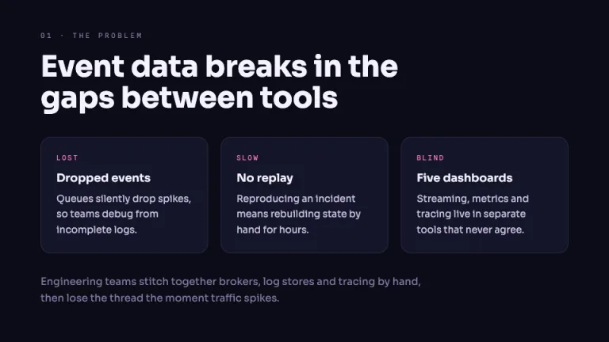
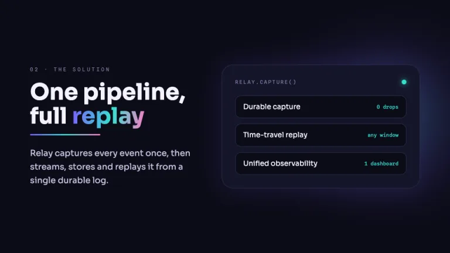
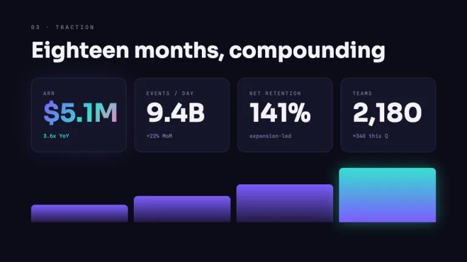

[← All prompts](../README.md) · [Live site](https://slidespeak.co/slide-design-prompts) · [SlideSpeak](https://slidespeak.co)

# Aurora

> Gradient pitch deck for SaaS

Deep indigo-black canvas with violet-cyan-pink gradients and soft glows. Built for the modern SaaS pitch deck that wants to look like a current Series A launch.

**Category:** Pitch decks &nbsp;·&nbsp; **Style:** Bold, Tech &nbsp;·&nbsp; **Mode:** Dark &nbsp;·&nbsp; **Fonts:** Sora + Spline Sans Mono

<table>
    <tr>
      <td align="center" width="33%"><br><sub>Cover</sub></td>
      <td align="center" width="33%"><br><sub>Problem</sub></td>
      <td align="center" width="33%"><br><sub>Solution</sub></td>
    </tr>
    <tr>
      <td align="center" width="33%"><br><sub>Traction</sub></td>
      <td align="center" width="33%"><br><sub>Market</sub></td>
      <td align="center" width="33%"><br><sub>The ask</sub></td>
    </tr>
</table>

## The prompt

Copy the prompt below into **ChatGPT**, **Claude**, or any AI chat — or grab the raw [`PROMPT.md`](./PROMPT.md). It asks what your presentation is about first, then applies the design to every slide.

```text
Create a presentation in the 'Aurora' theme: a modern SaaS pitch deck that reads like a current Series A launch. Background: deep indigo-black #0B0B16, with a wide aurora gradient sweeping from violet #7C5CFF through cyan #36E0D0 into pink #FF7AC6, dropped behind the hero as a soft radial glow and held at low opacity so text stays readable. Typography: headlines in Sora, 48 to 88px, weight 700, heading color #F4F3FF; eyebrows, labels, slide numbers and metric captions in Spline Sans Mono, 10 to 12px, uppercase, letterspaced, in muted #807CA6. Both are Google Fonts. Body runs 16 to 20px in #C3C0DE. Layout: generous margins, left-aligned blocks, surface #15152A panels with 1px #2A2A45 borders and rounded corners. Accents: one violet-to-cyan-to-pink gradient per slide on a headline word, an underline, a panel border or a glowing key metric; keep a single violet CTA tag. Strictly avoid: neon overload, full-saturation gradient fills behind body text, low-contrast gray-on-gray, clip art, light backgrounds.

Use this theme for my slides. Ask me what the presentation is about first, then apply the theme to every slide.
```

**[Open ChatGPT ↗](https://chatgpt.com/)** &nbsp;·&nbsp; **[Open Claude ↗](https://claude.ai/new)** &nbsp;·&nbsp; **[Generate a finished deck with SlideSpeak ↗](https://app.slidespeak.co/presentation?utm_source=github&utm_medium=referral&utm_campaign=slide-design-prompts)**

## Palette

| Role | Hex |
| --- | --- |
| Background | `#0B0B16` |
| Surface / panel | `#15152A` |
| Border | `#2A2A45` |
| Primary accent | `#7C5CFF` |
| Primary (soft tint) | `#221A45` |
| Text on primary | `#FFFFFF` |
| Heading text | `#F4F3FF` |
| Body text | `#C3C0DE` |
| Muted text | `#807CA6` |

**Chart series:** `#7C5CFF` `#36E0D0` `#FF7AC6` `#4A4A77`

## Fonts

- **Sora** (heading, Google Fonts)
- **Spline Sans Mono** (supporting, Google Fonts)

---

<sub>Part of [SlideSpeak Slide Design Prompts](../../README.md) · MIT licensed</sub>
