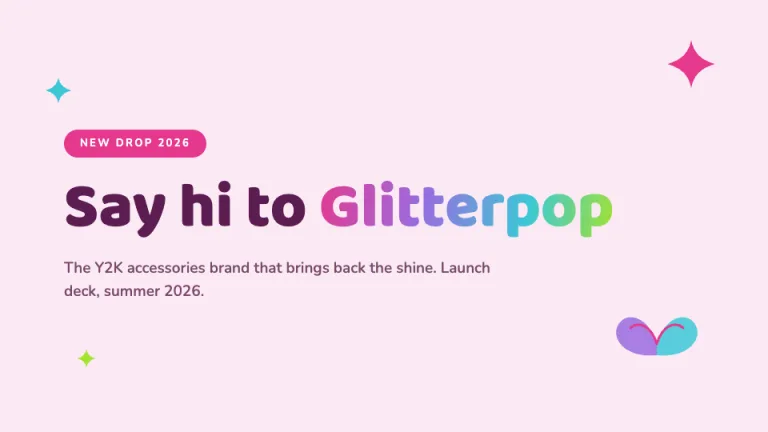
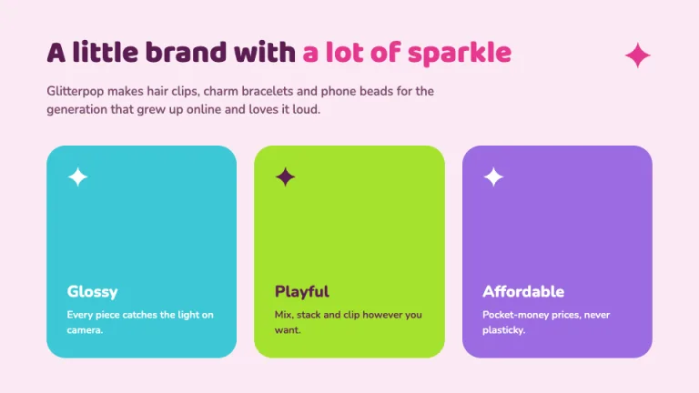
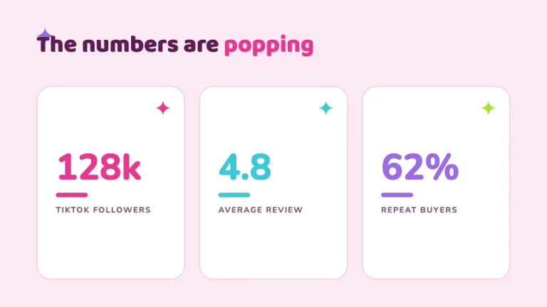
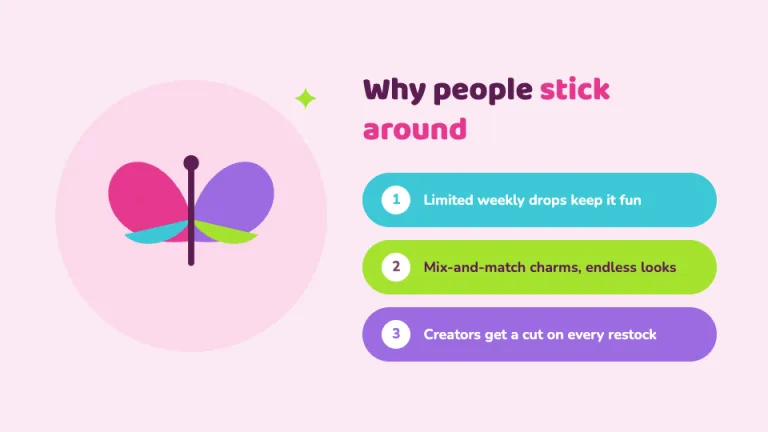
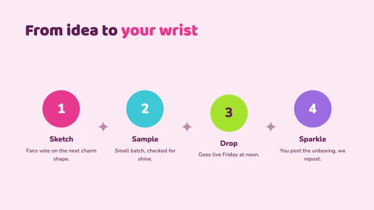
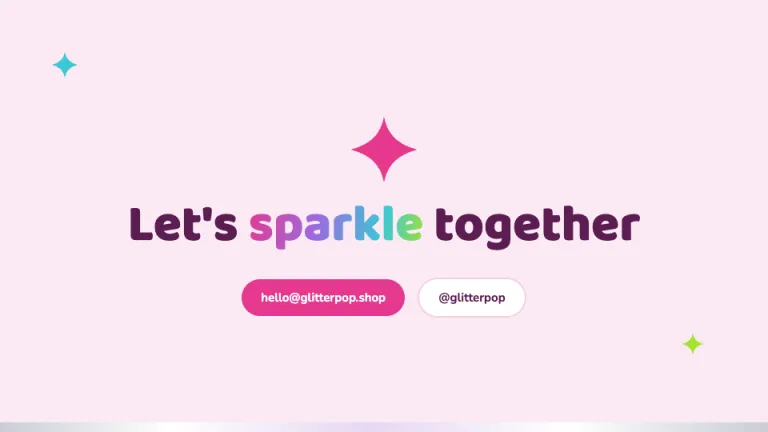

[← All prompts](../README.md) · [Live site](https://slidespeak.co/slide-design-prompts) · [SlideSpeak](https://slidespeak.co)

# Bubblegum

> Y2K sparkle with a system

A glossy Y2K brand deck in saturated hot pink, cyan, lime and purple on a pale bubblegum base, with chunky rounded Baloo 2 headlines, four-point sparkle stars, a butterfly motif and chrome-gradient accents kept legible and on a grid.

**Category:** Marketing & brand &nbsp;·&nbsp; **Style:** Playful, Bold &nbsp;·&nbsp; **Mode:** Light &nbsp;·&nbsp; **Fonts:** Baloo 2 + Nunito

<table>
    <tr>
      <td align="center" width="33%"><br><sub>Cover</sub></td>
      <td align="center" width="33%"><br><sub>Intro</sub></td>
      <td align="center" width="33%"><br><sub>Stats</sub></td>
    </tr>
    <tr>
      <td align="center" width="33%"><br><sub>Two-column</sub></td>
      <td align="center" width="33%"><br><sub>Process</sub></td>
      <td align="center" width="33%"><br><sub>Closing</sub></td>
    </tr>
</table>

## The prompt

Copy the prompt below into **ChatGPT**, **Claude**, or any AI chat — or grab the raw [`PROMPT.md`](./PROMPT.md). It asks what your presentation is about first, then applies the design to every slide.

```text
Create a presentation in the 'Bubblegum' theme: a glossy Y2K, early-2000s brand deck that feels like a sticker sheet and a lip-gloss compact, fun and high-energy but still systematic and legible. Background: pale bubblegum #FBEAF4 on every slide, with content sitting on pure white panels #FFFFFF inside a soft pink hairline #F6CFE6 and generously rounded corners (16 to 28px). Color system: hot pink #E5388E is the primary and the only color allowed behind white text via #FFFFFF; soft pink #FBD9EC fills quiet pills and panels; headings use deep plum #5B1D52, body copy uses muted plum #7A4A6E, and the faint #B98AAC is reserved for small labels. The candy quartet for stats, steps and bars is hot pink #E5388E, cyan #3CC8D6, lime #A6E22E and purple #9B6BE0, used in that order so the palette stays controlled. Typography: chunky rounded display in 'Baloo 2' for all headings and big numbers at 30 to 72px in #5B1D52, with rounded sans 'Nunito' for body and labels; both are Google Fonts. The signature grammar is three motifs used sparingly and consistently: four-point sparkle stars built as inline SVG (a plus-shaped diamond, never an emoji) placed near titles and as connectors; a single butterfly drawn from two mirrored rounded wing shapes in candy colors; and a chrome or candy gradient (a smooth linear-gradient through the quartet, or a silver-to-white-to-lilac chrome bar) used for one title word, one pill or one divider per slide. Keep text high-contrast and legible: never set body copy on a busy gradient, keep gradients behind big bold display words or in solid bars only, and let one motif lead each slide rather than scattering them. Layouts stay on a clear grid with real margins, rounded candy-colored bullet pills, glossy stat blocks and numbered bubble steps. Strictly avoid: stock photos and literal clip-art, drop shadows of any kind, illegible or low-contrast text laid over gradients, any color outside the bubblegum base and candy quartet, random emoji or scattered stars, dense multi-line bullet lists, and chaotic clip-art junk that reads as AI slop.

Use this theme for my slides. Ask me what the presentation is about first, then apply the theme to every slide.
```

**[Open ChatGPT ↗](https://chatgpt.com/)** &nbsp;·&nbsp; **[Open Claude ↗](https://claude.ai/new)** &nbsp;·&nbsp; **[Generate a finished deck with SlideSpeak ↗](https://app.slidespeak.co/presentation?utm_source=github&utm_medium=referral&utm_campaign=slide-design-prompts)**

## Palette

| Role | Hex |
| --- | --- |
| Background | `#FBEAF4` |
| Surface / panel | `#FFFFFF` |
| Border | `#F6CFE6` |
| Primary accent | `#E5388E` |
| Primary (soft tint) | `#FBD9EC` |
| Text on primary | `#FFFFFF` |
| Heading text | `#5B1D52` |
| Body text | `#7A4A6E` |
| Muted text | `#B98AAC` |

**Chart series:** `#E5388E` `#3CC8D6` `#A6E22E` `#9B6BE0`

## Fonts

- **Baloo 2** (heading, Google Fonts)
- **Nunito** (supporting, Google Fonts)

---

<sub>Part of [SlideSpeak Slide Design Prompts](../../README.md) · MIT licensed</sub>
