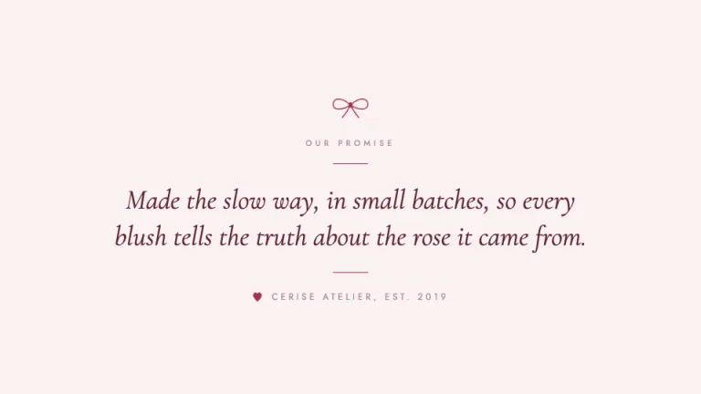
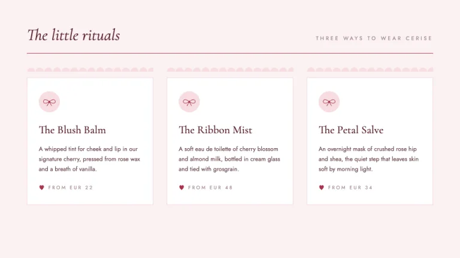
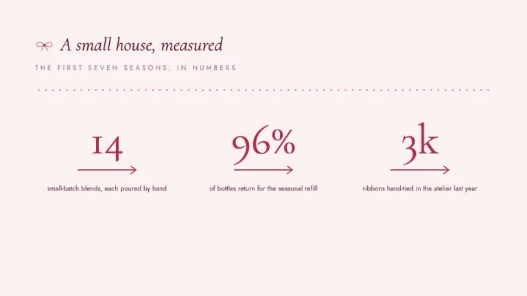
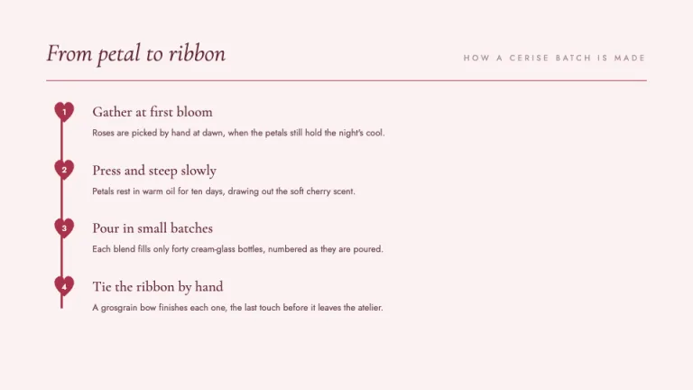
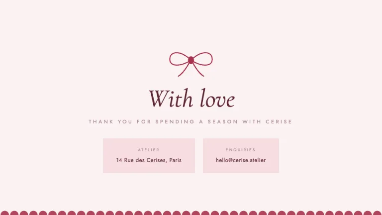

[← All prompts](../README.md) · [Live site](https://slidespeak.co/slide-design-prompts) · [SlideSpeak](https://slidespeak.co)

# Coquette

> Ribbons, blush and a cherry kiss

A romantic coquette lookbook deck in blush and cream with an oxblood cherry accent, a delicate high-contrast serif, and a signature motif of hand-tied bows, scalloped edges and small hearts.

**Category:** Creative & portfolio &nbsp;·&nbsp; **Style:** Elegant, Playful &nbsp;·&nbsp; **Mode:** Light &nbsp;·&nbsp; **Fonts:** Cormorant Garamond + Jost

<table>
    <tr>
      <td align="center" width="33%"><br><sub>Cover</sub></td>
      <td align="center" width="33%"><br><sub>Manifesto</sub></td>
      <td align="center" width="33%"><br><sub>Offerings</sub></td>
    </tr>
    <tr>
      <td align="center" width="33%"><br><sub>Stats</sub></td>
      <td align="center" width="33%"><br><sub>Ritual steps</sub></td>
      <td align="center" width="33%"><br><sub>Closing</sub></td>
    </tr>
</table>

## The prompt

Copy the prompt below into **ChatGPT**, **Claude**, or any AI chat — or grab the raw [`PROMPT.md`](./PROMPT.md). It asks what your presentation is about first, then applies the design to every slide.

```text
Create a presentation in the 'Coquette' theme: a romantic, soft-pretty lookbook styled like a small-batch beauty atelier, all blush and cream with a single cherry kiss of color. Background: blush #FBF1F2 on every slide, with cards and placards lifted onto pure white #FFFFFF or a soft blush wash #F7DDE2, separated by hairline borders in #F0D9DC. Layout grammar: generous air, centered or single-column compositions, scalloped edges and dividers built from repeating-radial-gradient or inline SVG, and a recurring signature motif of a hand-tied ribbon bow drawn as SVG paths, thin ribbon banners, and tiny hearts as section markers and timeline nodes. Typography: display lines and headings in the high-contrast serif 'Cormorant Garamond', often italic, at 30 to 84px in deep oxblood #5E2733, with small uppercase kickers and body copy in 'Jost' at 11 to 16px in #6B4750, letter-spaced around 0.28em for the kickers and labels in muted rose #A98A91; both 'Cormorant Garamond' and 'Jost' are Google Fonts. Accent: keep the cherry oxblood #A8324A as the only saturated color, used for the bows, hairline rules, ribbon underlines, oversized numerals and heart nodes, and use the blush soft #F7DDE2 as the gentle fill behind cards; never introduce a second accent. Charts and accents draw from #A8324A, #D98C9A, #E8B4BC and #C76B7E. Keep it elegant and tender rather than girly-cliche: thin rules, scalloped trims, italic serif over warm blush, the bow as the quietest signature in the room. Strictly avoid: real or stock photos and clipart, drop shadows, rounded heavy cards, random or rainbow gradients, a second accent color, neon or saturated brights, dense bullet walls, and emoji.

Use this theme for my slides. Ask me what the presentation is about first, then apply the theme to every slide.
```

**[Open ChatGPT ↗](https://chatgpt.com/)** &nbsp;·&nbsp; **[Open Claude ↗](https://claude.ai/new)** &nbsp;·&nbsp; **[Generate a finished deck with SlideSpeak ↗](https://app.slidespeak.co/presentation?utm_source=github&utm_medium=referral&utm_campaign=slide-design-prompts)**

## Palette

| Role | Hex |
| --- | --- |
| Background | `#FBF1F2` |
| Surface / panel | `#FFFFFF` |
| Border | `#F0D9DC` |
| Primary accent | `#A8324A` |
| Primary (soft tint) | `#F7DDE2` |
| Text on primary | `#FFFFFF` |
| Heading text | `#5E2733` |
| Body text | `#6B4750` |
| Muted text | `#A98A91` |

**Chart series:** `#A8324A` `#D98C9A` `#E8B4BC` `#C76B7E`

## Fonts

- **Cormorant Garamond** (heading, Google Fonts)
- **Jost** (supporting, Google Fonts)

---

<sub>Part of [SlideSpeak Slide Design Prompts](../../README.md) · MIT licensed</sub>
