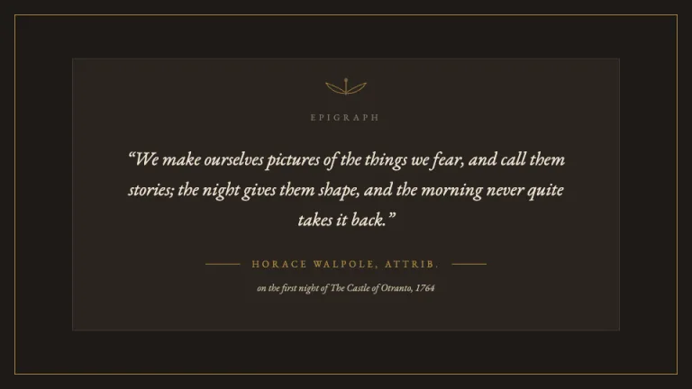
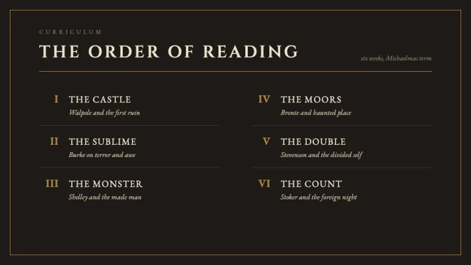
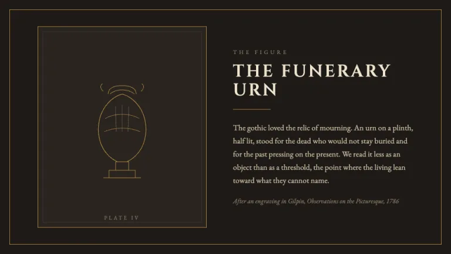
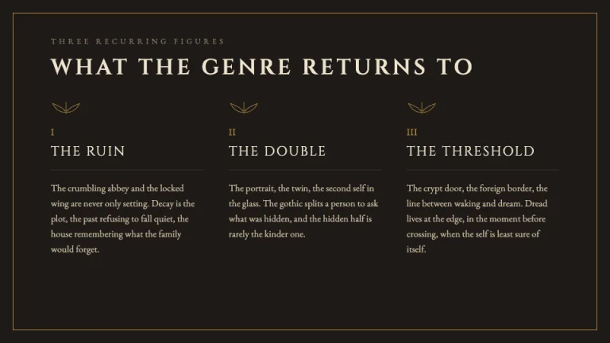
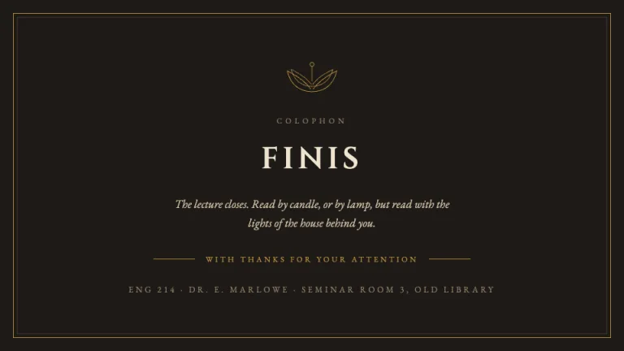

[← All prompts](../README.md) · [Live site](https://slidespeak.co/slide-design-prompts) · [SlideSpeak](https://slidespeak.co)

# Dark Academia

> Candlelit library, rare-books society

A scholarly, moody dark-academia deck in espresso-black and brown with parchment text and an antique-gold accent, a roman-capital display serif paired with a classic book serif, and a signature motif of hairline rules, laurel wreaths and engraved gold frames.

**Category:** Creative & portfolio &nbsp;·&nbsp; **Style:** Elegant, Dark &nbsp;·&nbsp; **Mode:** Dark &nbsp;·&nbsp; **Fonts:** Cinzel + EB Garamond

<table>
    <tr>
      <td align="center" width="33%"><br><sub>Cover</sub></td>
      <td align="center" width="33%"><br><sub>Epigraph</sub></td>
      <td align="center" width="33%"><br><sub>Contents</sub></td>
    </tr>
    <tr>
      <td align="center" width="33%"><br><sub>Plate</sub></td>
      <td align="center" width="33%"><br><sub>Themes</sub></td>
      <td align="center" width="33%"><br><sub>Colophon</sub></td>
    </tr>
</table>

## The prompt

Copy the prompt below into **ChatGPT**, **Claude**, or any AI chat — or grab the raw [`PROMPT.md`](./PROMPT.md). It asks what your presentation is about first, then applies the design to every slide.

```text
Create a presentation in the 'Dark Academia' theme: a scholarly, candlelit deck styled like a lecture from a rare-books society, deep and moody but refined. Background: espresso-black #1E1A17 on every slide, with quieter panels and inner frames lifted onto a warm dark surface #2A2420 separated by hairline borders in #3D352E and a soft brown wash #3A2E22 behind sidebars and drop-caps. Layout grammar: a thin antique-gold keyline framing the page, generous margins, centered or two-column compositions, and a recurring signature motif of a laurel wreath, classical hairline rules and an engraved gold frame, all drawn as inline SVG strokes (a laurel sprig, a fluted column, an urn or a bust rendered in 0.75 to 1.5px gold lines, never a photo). Typography: titles, section headers, plate labels and roman numerals in the roman-capital display serif 'Cinzel', usually all-caps and letter-spaced around 0.18em to 0.3em at 28 to 64px in parchment #EDE3CE; epigraphs, captions and all body copy in the classic book serif 'EB Garamond', often italic for quotations, at 14 to 27px in warm parchment-tan #C9BBA0, with kickers and footnotes in muted khaki #8C7E68; both 'Cinzel' and 'EB Garamond' are Google Fonts. Accent: keep the antique gold #B08A3E as the only metal, used for the page keyline, hairline rules, laurel and frame strokes, roman numerals and a single drop-cap fill on the soft-brown wash #3A2E22; never let it become a glowing or neon yellow. Charts and accents draw from antique gold #B08A3E, oxblood #8C3B2E, olive laurel #6E7B53 and tan leather #A9784B. Contrast discipline: parchment heading #EDE3CE and body #C9BBA0 must always sit on the dark espresso or surface, never gold-on-gold or low-contrast gray-on-black, and reserve muted khaki only for small kickers and footnotes that do not carry meaning alone. Keep it engraved and bookish rather than costume-y: thin gold hairlines, a laurel as the quietest signature, roman capitals over candlelit dark. Strictly avoid: real or stock photos and clipart, drop shadows, low-contrast gray-on-black text, neon or saturated brights, a second bright accent color beside the gold, dense bullet walls, and emoji.

Use this theme for my slides. Ask me what the presentation is about first, then apply the theme to every slide.
```

**[Open ChatGPT ↗](https://chatgpt.com/)** &nbsp;·&nbsp; **[Open Claude ↗](https://claude.ai/new)** &nbsp;·&nbsp; **[Generate a finished deck with SlideSpeak ↗](https://app.slidespeak.co/presentation?utm_source=github&utm_medium=referral&utm_campaign=slide-design-prompts)**

## Palette

| Role | Hex |
| --- | --- |
| Background | `#1E1A17` |
| Surface / panel | `#2A2420` |
| Border | `#3D352E` |
| Primary accent | `#B08A3E` |
| Primary (soft tint) | `#3A2E22` |
| Text on primary | `#1E1A17` |
| Heading text | `#EDE3CE` |
| Body text | `#C9BBA0` |
| Muted text | `#8C7E68` |

**Chart series:** `#B08A3E` `#8C3B2E` `#6E7B53` `#A9784B`

## Fonts

- **Cinzel** (heading, Google Fonts)
- **EB Garamond** (supporting, Google Fonts)

---

<sub>Part of [SlideSpeak Slide Design Prompts](../../README.md) · MIT licensed</sub>
