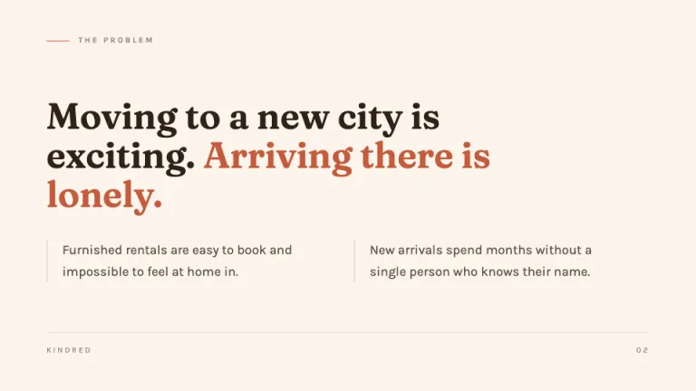
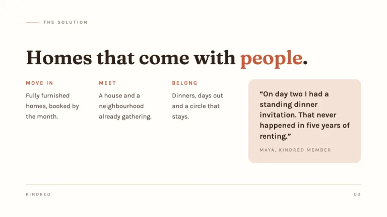
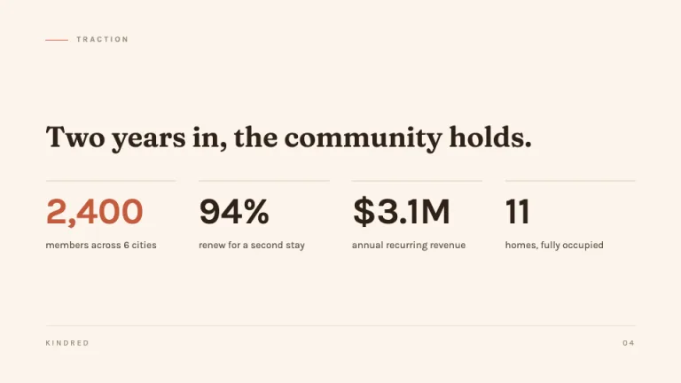
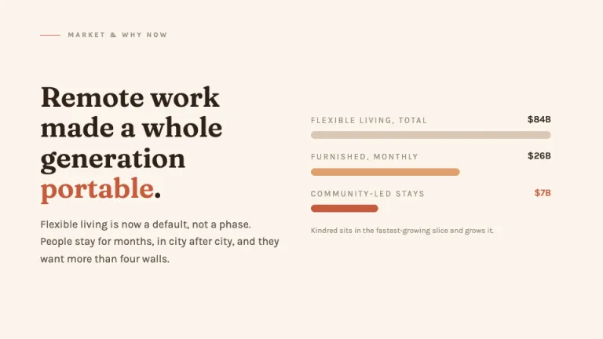
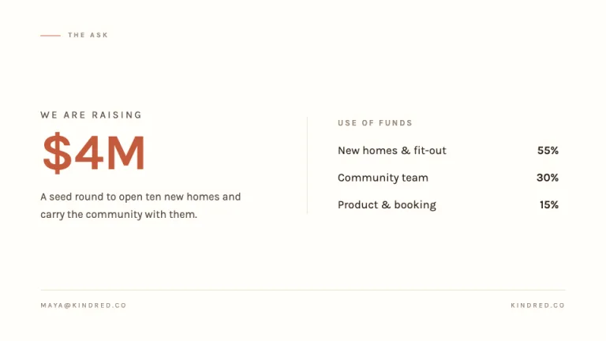

[← All prompts](../README.md) · [Live site](https://slidespeak.co/slide-design-prompts) · [SlideSpeak](https://slidespeak.co)

# Hearth

> Warm, story-led brand pitch

A story-led pitch deck on soft cream, with elegant serif headlines and a single clay accent. Built for warm, brand-led narratives.

**Category:** Pitch decks &nbsp;·&nbsp; **Style:** Warm, Minimal &nbsp;·&nbsp; **Mode:** Light &nbsp;·&nbsp; **Fonts:** Fraunces + Karla

<table>
    <tr>
      <td align="center" width="33%"><br><sub>Cover</sub></td>
      <td align="center" width="33%"><br><sub>Problem</sub></td>
      <td align="center" width="33%"><br><sub>Solution</sub></td>
    </tr>
    <tr>
      <td align="center" width="33%"><br><sub>Traction</sub></td>
      <td align="center" width="33%"><br><sub>Market</sub></td>
      <td align="center" width="33%"><br><sub>The ask</sub></td>
    </tr>
</table>

## The prompt

Copy the prompt below into **ChatGPT**, **Claude**, or any AI chat — or grab the raw [`PROMPT.md`](./PROMPT.md). It asks what your presentation is about first, then applies the design to every slide.

```text
Create a presentation in the 'Hearth' theme: a warm, story-led pitch deck that feels crafted and human. Background: soft cream #FBF4EC across slides, with a warmer surface #FFFDF9 on one or two slides for contrast. Typography: headlines in 'Fraunces' (Google Font serif) set large at 44 to 80px in deep warm brown #2E2117, with calm leading; body in 'Karla' (Google Font sans) at 16 to 20px in #5C4F43. Small labels and eyebrows use 'Karla' at 11 to 13px, uppercase, letter-spaced. Layout: generous margins, editorial spacing, mostly left-aligned columns with room to breathe; thin hairline rules in #ECDFD0 to divide sections. Accents: one clay #C45B3C touch per slide, a single emphasized word, a short tag, or a thin underline, and a soft #F6E2D7 block behind one quote or stat. Strictly avoid: gradients, drop shadows, hard geometric grids, neon or cool blues, dense bullet walls, more than one clay accent per slide, and icon clip-art.

Use this theme for my slides. Ask me what the presentation is about first, then apply the theme to every slide.
```

**[Open ChatGPT ↗](https://chatgpt.com/)** &nbsp;·&nbsp; **[Open Claude ↗](https://claude.ai/new)** &nbsp;·&nbsp; **[Generate a finished deck with SlideSpeak ↗](https://app.slidespeak.co/presentation?utm_source=github&utm_medium=referral&utm_campaign=slide-design-prompts)**

## Palette

| Role | Hex |
| --- | --- |
| Background | `#FBF4EC` |
| Surface / panel | `#FFFDF9` |
| Border | `#ECDFD0` |
| Primary accent | `#C45B3C` |
| Primary (soft tint) | `#F6E2D7` |
| Text on primary | `#FFFFFF` |
| Heading text | `#2E2117` |
| Body text | `#5C4F43` |
| Muted text | `#998A7A` |

**Chart series:** `#C45B3C` `#2E2117` `#E0A06F` `#D9C7B4`

## Fonts

- **Fraunces** (heading, Google Fonts)
- **Karla** (supporting, Google Fonts)

---

<sub>Part of [SlideSpeak Slide Design Prompts](../../README.md) · MIT licensed</sub>
