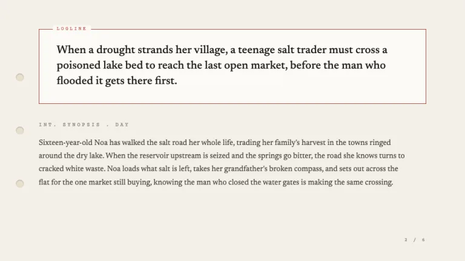
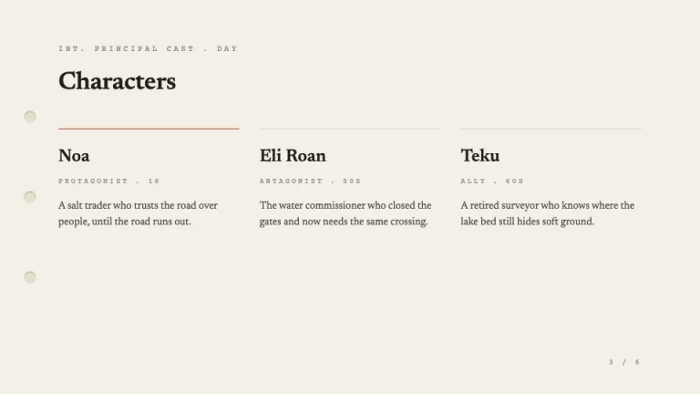
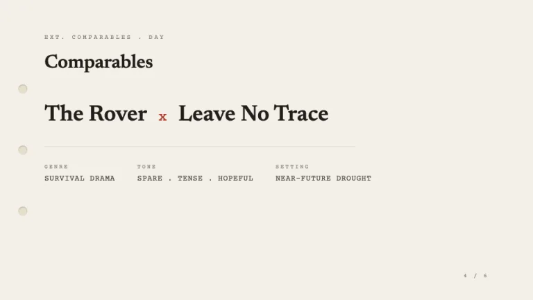
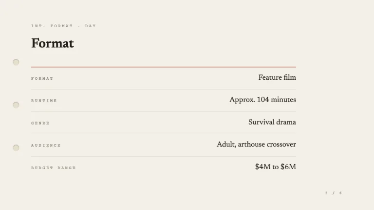
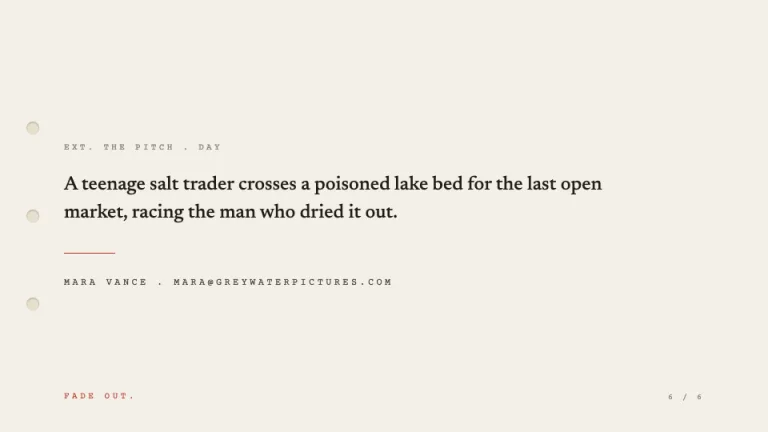

[← All prompts](../README.md) · [Live site](https://slidespeak.co/slide-design-prompts) · [SlideSpeak](https://slidespeak.co)

# Logline

> The pitch in one page

A film treatment laid out like a screenplay: a boxed logline, a serif reading column for the synopsis, character cards, and a comparables row. Warm paper, ink type, one brick-red revision accent.

**Category:** Creative & portfolio &nbsp;·&nbsp; **Style:** Minimal, Elegant &nbsp;·&nbsp; **Mode:** Light &nbsp;·&nbsp; **Fonts:** Newsreader + Courier Prime

<table>
    <tr>
      <td align="center" width="33%"><br><sub>Title page</sub></td>
      <td align="center" width="33%"><br><sub>Logline</sub></td>
      <td align="center" width="33%"><br><sub>Characters</sub></td>
    </tr>
    <tr>
      <td align="center" width="33%"><br><sub>Comparables</sub></td>
      <td align="center" width="33%"><br><sub>Format</sub></td>
      <td align="center" width="33%"><br><sub>Closing</sub></td>
    </tr>
</table>

## The prompt

Copy the prompt below into **ChatGPT**, **Claude**, or any AI chat — or grab the raw [`PROMPT.md`](./PROMPT.md). It asks what your presentation is about first, then applies the design to every slide.

```text
Create a presentation in the 'Logline' theme: a film treatment and pitch document styled like a readable screenplay on warm manuscript paper. Background: warm paper #F3EFE7, with the occasional panel on #FBFAF6 surface. Typography uses two Google Fonts: 'Newsreader', a literary serif, for the treatment title, the synopsis reading column and character names, at 18 to 56px in ink #211E1A for headings and #4C4842 for body; and 'Courier Prime', a screenplay monospace, for every label, set ALL-CAPS and letter-spaced around 0.2em in muted #8C867A. The layout grammar is screenplay grammar: short Courier slug-line section labels like 'INT. SYNOPSIS . DAY' or 'EXT. THE STAKES . NIGHT' mark each section; the logline sits in a boxed panel at the top of the page, outlined with a 1px hairline (brick-red #B23A2E or border #DAD3C5) and tagged with a small Courier 'LOGLINE' label in the corner; the synopsis runs as a single serif reading column with generous leading; characters are a clean grid of cards, each a Newsreader name over a Courier role label over a one-line serif description; comparables are a single row naming reference films as plain text like 'FILM A x FILM B' with Courier tone and genre words; format facts sit in a label-and-value table, Courier labels on the left, Newsreader values on the right. Brick-red #B23A2E is the single accent, used only as a hairline, a small revision stamp like 'DRAFT 3 . 06.19.2026', or the logline box edge. A Courier page-number footer like '6 / 6' anchors the lower corner like a script page. Down the left margin of every page run three small, evenly spaced punch holes, recessed circles in the paper, so each page reads like a bound script. Keep it quiet, type-only and confident, with hairline rules and wide margins. Strictly avoid: a second accent color, gradients, drop shadows, rounded cards, photos, icons or clipart, sans-serif fonts, dense bullet lists, and decorative shapes other than the binding holes and 1px rules.

Use this theme for my slides. Ask me what the presentation is about first, then apply the theme to every slide.
```

**[Open ChatGPT ↗](https://chatgpt.com/)** &nbsp;·&nbsp; **[Open Claude ↗](https://claude.ai/new)** &nbsp;·&nbsp; **[Generate a finished deck with SlideSpeak ↗](https://app.slidespeak.co/presentation?utm_source=github&utm_medium=referral&utm_campaign=slide-design-prompts)**

## Palette

| Role | Hex |
| --- | --- |
| Background | `#F3EFE7` |
| Surface / panel | `#FBFAF6` |
| Border | `#DAD3C5` |
| Primary accent | `#B23A2E` |
| Primary (soft tint) | `#EFDDD7` |
| Text on primary | `#FFFFFF` |
| Heading text | `#211E1A` |
| Body text | `#4C4842` |
| Muted text | `#8C867A` |

**Chart series:** `#B23A2E` `#211E1A` `#C9A99E` `#DAD3C5`

## Fonts

- **Newsreader** (heading, Google Fonts)
- **Courier Prime** (supporting, Google Fonts)

---

<sub>Part of [SlideSpeak Slide Design Prompts](../../README.md) · MIT licensed</sub>
