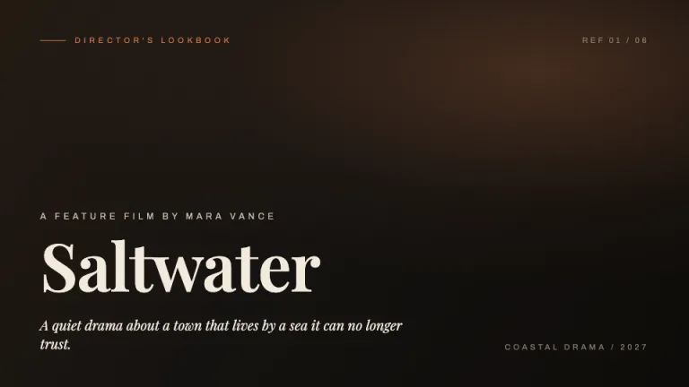
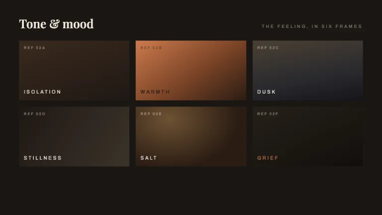
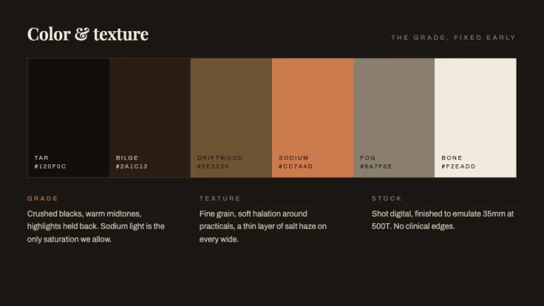
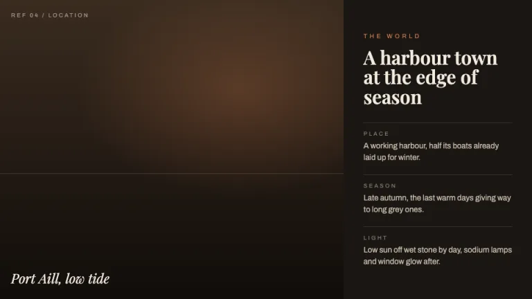
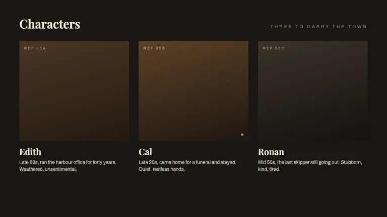
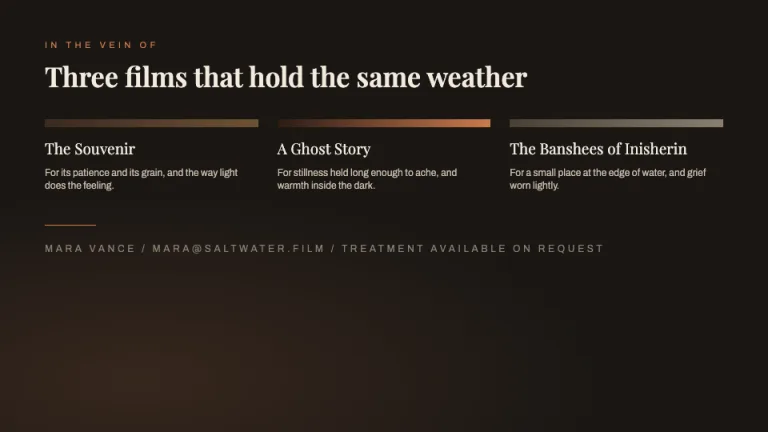

[← All prompts](../README.md) · [Live site](https://slidespeak.co/slide-design-prompts) · [SlideSpeak](https://slidespeak.co)

# Lookbook

> Mood, tone and frame

A director's film lookbook built from full-bleed tonal still plates, tone-word captions and a single terracotta accent. Image-led and warm, made to pitch the feel of a film before a frame is shot.

**Category:** Creative & portfolio &nbsp;·&nbsp; **Style:** Elegant, Dark &nbsp;·&nbsp; **Mode:** Dark &nbsp;·&nbsp; **Fonts:** Playfair Display + Archivo

<table>
    <tr>
      <td align="center" width="33%"><br><sub>Cover</sub></td>
      <td align="center" width="33%"><br><sub>Tone and mood</sub></td>
      <td align="center" width="33%"><br><sub>Color and texture</sub></td>
    </tr>
    <tr>
      <td align="center" width="33%"><br><sub>World</sub></td>
      <td align="center" width="33%"><br><sub>Characters</sub></td>
      <td align="center" width="33%"><br><sub>References</sub></td>
    </tr>
</table>

## The prompt

Copy the prompt below into **ChatGPT**, **Claude**, or any AI chat — or grab the raw [`PROMPT.md`](./PROMPT.md). It asks what your presentation is about first, then applies the design to every slide.

```text
Create a presentation in the 'Lookbook' theme: a director's film lookbook, the printed tone-and-mood reference used to pitch a film, image-led and warm rather than cold noir. Background: warm near-black #1A1714, with panels on #262019 and 1px hairlines in #3B332A. Typography: titles, film name and tone statements in 'Playfair Display' serif at 40 to 92px, weight 500 to 700, warm off-white #F2EADD; all labels, tone words, location and wardrobe notes, swatch captions and reference names in 'Archivo' sans, uppercase, small at 10 to 13px, letter-spaced about 0.28em, in muted #8A7F6E or body #C8BCAA. Both are Google Fonts. Layout grammar: full-bleed tonal still plates arranged in an editorial grid, each plate a CSS gradient or duotone of warm charcoals, deep browns and amber standing in for a reference frame, never a real photo, carrying a faint 'REF 01' style Archivo label and a one-word tone caption like ISOLATION, WARMTH or DUSK. Include a horizontal palette swatch strip of five or six swatches with hex and labels, plus annotation cards for location and wardrobe (place, season, light, casting note). Reserve terracotta amber #CC7A4D as the single accent: one hairline rule, one tone word, or one swatch per slide, never spread across the layout. Charts, if any, stay tonal bars in #CC7A4D and #4A4034 on a #3B332A baseline. Strictly avoid: real or stock photos, clipart and icons, a second accent color, bright or cold backgrounds, drop shadows, rounded card chrome, and dense bullet lists.

Use this theme for my slides. Ask me what the presentation is about first, then apply the theme to every slide.
```

**[Open ChatGPT ↗](https://chatgpt.com/)** &nbsp;·&nbsp; **[Open Claude ↗](https://claude.ai/new)** &nbsp;·&nbsp; **[Generate a finished deck with SlideSpeak ↗](https://app.slidespeak.co/presentation?utm_source=github&utm_medium=referral&utm_campaign=slide-design-prompts)**

## Palette

| Role | Hex |
| --- | --- |
| Background | `#1A1714` |
| Surface / panel | `#262019` |
| Border | `#3B332A` |
| Primary accent | `#CC7A4D` |
| Primary (soft tint) | `#3A2A1E` |
| Text on primary | `#1A1714` |
| Heading text | `#F2EADD` |
| Body text | `#C8BCAA` |
| Muted text | `#8A7F6E` |

**Chart series:** `#CC7A4D` `#F2EADD` `#8A7F6E` `#4A4034`

## Fonts

- **Playfair Display** (heading, Google Fonts)
- **Archivo** (supporting, Google Fonts)

---

<sub>Part of [SlideSpeak Slide Design Prompts](../../README.md) · MIT licensed</sub>
