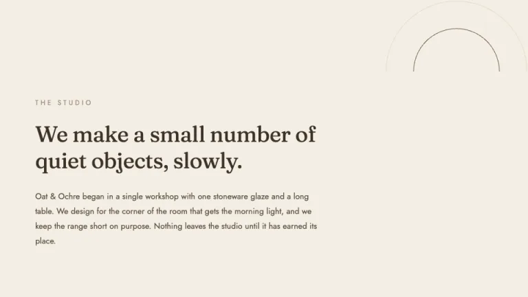
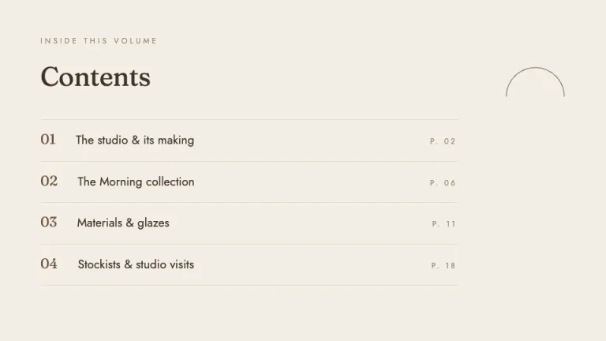
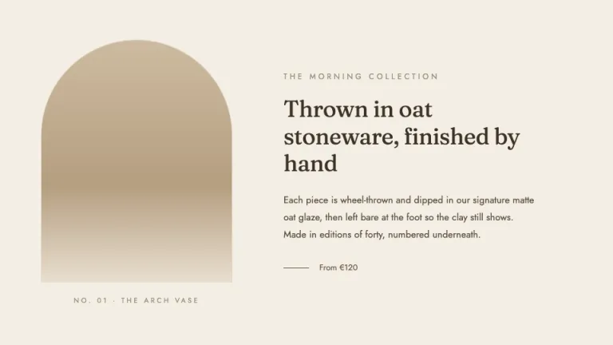
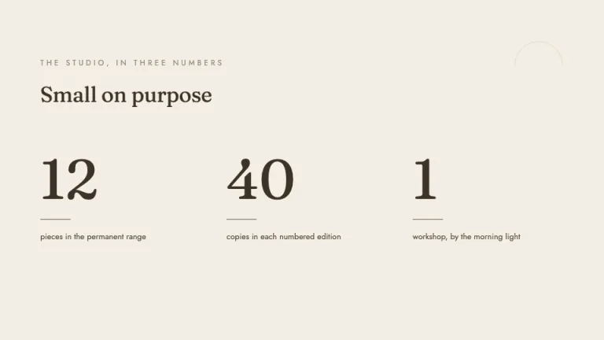
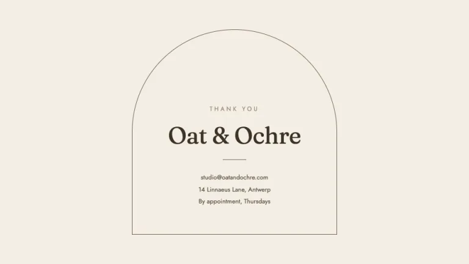

[← All prompts](../README.md) · [Live site](https://slidespeak.co/slide-design-prompts) · [SlideSpeak](https://slidespeak.co)

# Oat

> Warm neutrals, quiet arches, expensive calm

A beige minimalist lookbook theme in warm oats and creams with a single espresso accent, a soft Fraunces serif paired with clean Jost, and a signature arch motif framing slides built almost entirely from whitespace.

**Category:** Creative & portfolio &nbsp;·&nbsp; **Style:** Minimal, Calm &nbsp;·&nbsp; **Mode:** Light &nbsp;·&nbsp; **Fonts:** Fraunces + Jost

<table>
    <tr>
      <td align="center" width="33%"><br><sub>Cover</sub></td>
      <td align="center" width="33%"><br><sub>Editorial intro</sub></td>
      <td align="center" width="33%"><br><sub>Contents</sub></td>
    </tr>
    <tr>
      <td align="center" width="33%"><br><sub>Two-up</sub></td>
      <td align="center" width="33%"><br><sub>Stat trio</sub></td>
      <td align="center" width="33%"><br><sub>Closing</sub></td>
    </tr>
</table>

## The prompt

Copy the prompt below into **ChatGPT**, **Claude**, or any AI chat — or grab the raw [`PROMPT.md`](./PROMPT.md). It asks what your presentation is about first, then applies the design to every slide.

```text
Create a presentation in the 'Oat' theme: a warm, beige minimalist lookbook in the calm, expensive 'clean girl' aesthetic, all restraint and air. Every slide sits on an oat background #F4EEE4, with the occasional raised panel in a lighter cream #FBF8F2 and hairline keylines in soft tan #E3D9C8. Typography uses two Google Fonts: headings, display numerals and short titles in the soft modern serif 'Fraunces' from 30 to 96px in deep espresso-brown #3D3328, set generously with relaxed leading; all body copy, kickers, labels and index lines in the clean geometric sans 'Jost' from 11 to 16px in warm brown #5C5142, with small uppercase kickers letter-spaced around 0.3em in muted taupe #9A8E7A. The signature motif is the arch: thin outlined semicircles and arched frames drawn with inline SVG strokes or top border-radius, plus the odd soft organic blob in tan, used as a quiet structural mark rather than decoration. Accent discipline is the whole point, the single espresso #6B5644 appears only as a thin rule, a small index numeral, an arch stroke or one filled shape, never as a second color and never behind body text; a pale oat fill #E8DECF and a tan #B59E80 carry the arched image placeholders as soft vertical gradients. Lean hard on whitespace: wide margins, one idea per slide, large quiet headings floating in empty oat, and never fill a slide just because it is empty. Strictly avoid: stock photos, clipart and any literal imagery, drop shadows, rounded card stacks, a second accent color, saturated or neon colors, dense bullet lists, decorative ornament or flourishes, and emoji.

Use this theme for my slides. Ask me what the presentation is about first, then apply the theme to every slide.
```

**[Open ChatGPT ↗](https://chatgpt.com/)** &nbsp;·&nbsp; **[Open Claude ↗](https://claude.ai/new)** &nbsp;·&nbsp; **[Generate a finished deck with SlideSpeak ↗](https://app.slidespeak.co/presentation?utm_source=github&utm_medium=referral&utm_campaign=slide-design-prompts)**

## Palette

| Role | Hex |
| --- | --- |
| Background | `#F4EEE4` |
| Surface / panel | `#FBF8F2` |
| Border | `#E3D9C8` |
| Primary accent | `#6B5644` |
| Primary (soft tint) | `#E8DECF` |
| Text on primary | `#FBF8F2` |
| Heading text | `#3D3328` |
| Body text | `#5C5142` |
| Muted text | `#9A8E7A` |

**Chart series:** `#6B5644` `#B59E80` `#CDBBA0` `#8A7355`

## Fonts

- **Fraunces** (heading, Google Fonts)
- **Jost** (supporting, Google Fonts)

---

<sub>Part of [SlideSpeak Slide Design Prompts](../../README.md) · MIT licensed</sub>
