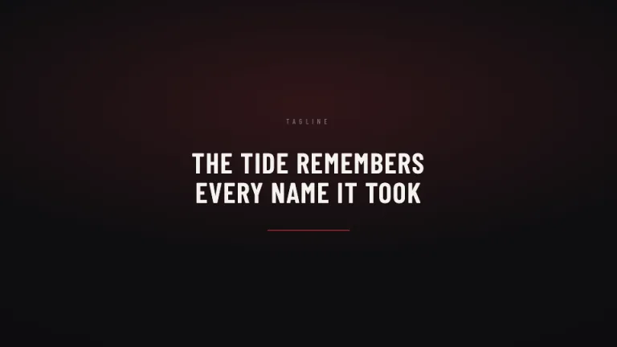
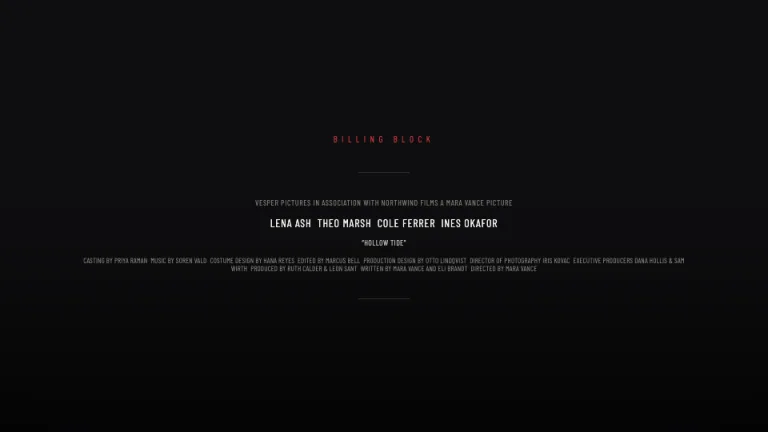
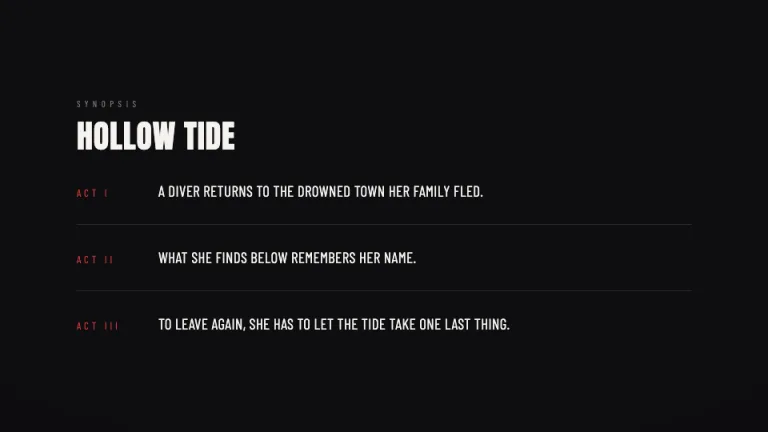
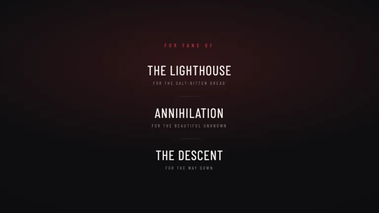
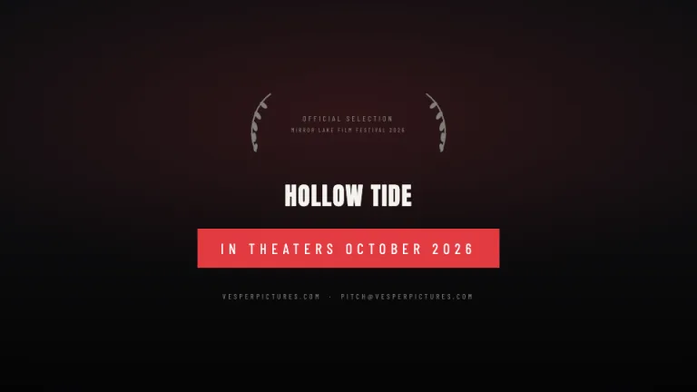

[← All prompts](../README.md) · [Live site](https://slidespeak.co/slide-design-prompts) · [SlideSpeak](https://slidespeak.co)

# One Sheet

> Top of the billing

The theatrical movie one-sheet as a deck: a giant condensed title treatment, a single crimson accent on near-black, and a real squashed billing block. Built to pitch like a film, not a slideshow.

**Category:** Creative & portfolio &nbsp;·&nbsp; **Style:** Bold, Dark &nbsp;·&nbsp; **Mode:** Dark &nbsp;·&nbsp; **Fonts:** Anton + Barlow Condensed

<table>
    <tr>
      <td align="center" width="33%"><br><sub>One-sheet</sub></td>
      <td align="center" width="33%"><br><sub>Tagline</sub></td>
      <td align="center" width="33%"><br><sub>Billing block</sub></td>
    </tr>
    <tr>
      <td align="center" width="33%"><br><sub>Synopsis</sub></td>
      <td align="center" width="33%"><br><sub>For fans of</sub></td>
      <td align="center" width="33%"><br><sub>In theaters</sub></td>
    </tr>
</table>

## The prompt

Copy the prompt below into **ChatGPT**, **Claude**, or any AI chat — or grab the raw [`PROMPT.md`](./PROMPT.md). It asks what your presentation is about first, then applies the design to every slide.

```text
Create a presentation in the 'One Sheet' theme, a theatrical movie one-sheet poster turned into slides. Background: near-black #0E0E10 on every slide, deepened with built-in CSS vignettes (a soft radial glow behind the title, a darker linear gradient toward the bottom edge), no photos. Type: the poster title is set in 'Anton' (a heavy condensed display face), all caps, huge at 96 to 180px with tight leading near 0.85, stacked across two or three lines so it reads like a real title treatment; everything else is 'Barlow Condensed' (both are Google Fonts). Color is bone-white #F5F3EF for headings, warm gray #BDBAB4 for body, dim #807D77 for fine print, and a single hot crimson #E23B41 as the only accent: one thin crimson rule, one crimson date bar, one crimson award line, never more than one hot moment per slide. The signature element is the squashed billing block: tiny Barlow Condensed, all caps, around 9 to 11px, letter-spacing near 0.02em, tight line-height near 1.05, opening with a studio-presents line, then the cast names, then one long run-on credit sentence of crew roles and names exactly like the bottom of a poster. Use festival laurel marks drawn as facing SVG branches in #807D77 or crimson with an award line set between them. Close on an 'IN THEATERS [MONTH] [YEAR]' bar. Layout grammar per slide: one huge Anton title treatment or one dominant idea, a tagline line, the billing block, laurels, and the date bar, composed with a strong vertical center axis like a poster. Strictly avoid: a second accent color, gradients in any color other than black and crimson, drop shadows, clipart, stock photos, emoji, rounded card containers, light backgrounds, and the fonts font-sans, font-serif or font-mono.

Use this theme for my slides. Ask me what the presentation is about first, then apply the theme to every slide.
```

**[Open ChatGPT ↗](https://chatgpt.com/)** &nbsp;·&nbsp; **[Open Claude ↗](https://claude.ai/new)** &nbsp;·&nbsp; **[Generate a finished deck with SlideSpeak ↗](https://app.slidespeak.co/presentation?utm_source=github&utm_medium=referral&utm_campaign=slide-design-prompts)**

## Palette

| Role | Hex |
| --- | --- |
| Background | `#0E0E10` |
| Surface / panel | `#18181C` |
| Border | `#2C2C32` |
| Primary accent | `#E23B41` |
| Primary (soft tint) | `#2A1416` |
| Text on primary | `#FFFFFF` |
| Heading text | `#F5F3EF` |
| Body text | `#BDBAB4` |
| Muted text | `#807D77` |

**Chart series:** `#E23B41` `#F5F3EF` `#807D77` `#3A3A40`

## Fonts

- **Anton** (heading, Google Fonts)
- **Barlow Condensed** (supporting, Google Fonts)

---

<sub>Part of [SlideSpeak Slide Design Prompts](../../README.md) · MIT licensed</sub>
