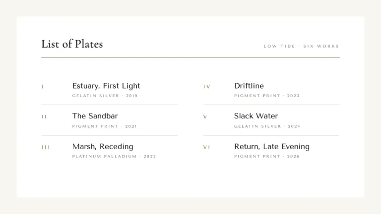
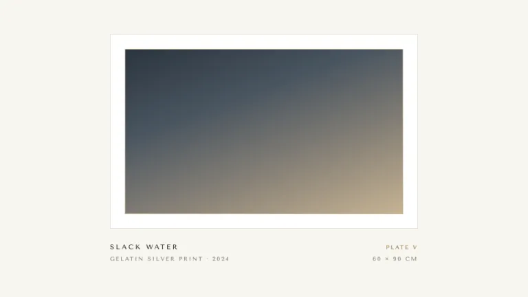
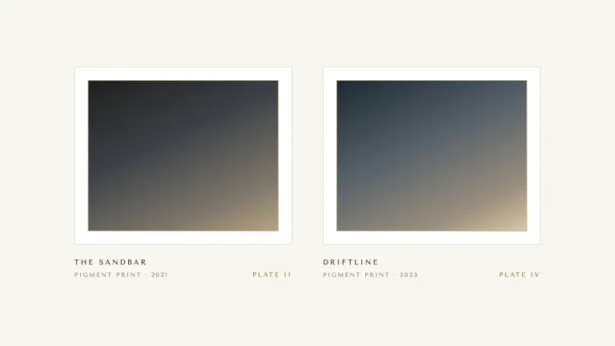
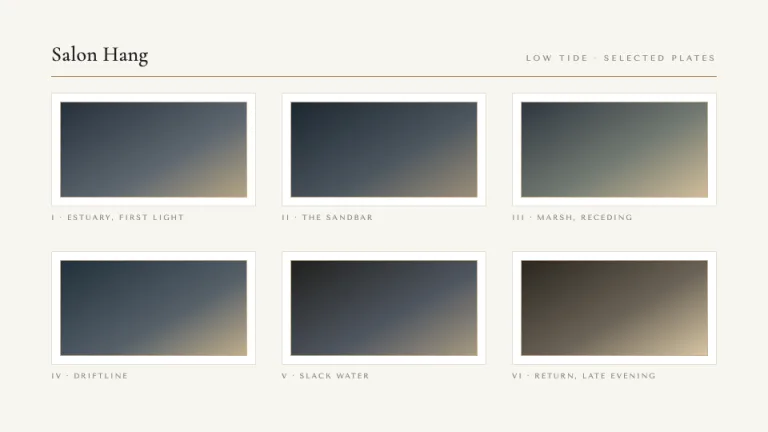
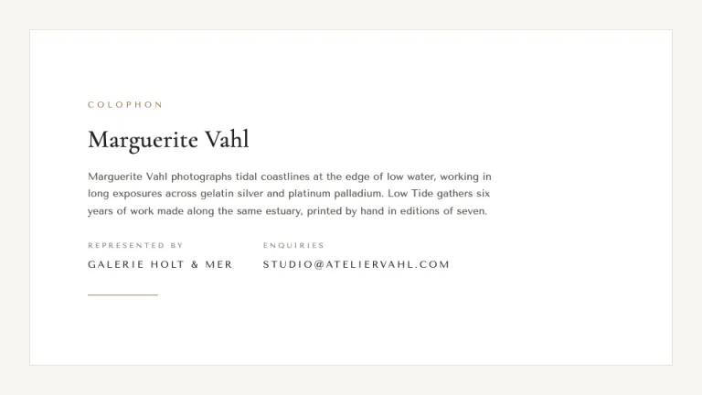

[← All prompts](../README.md) · [Live site](https://slidespeak.co/slide-design-prompts) · [SlideSpeak](https://slidespeak.co)

# Passepartout

> A gallery on every slide

A fine-art portfolio deck where every image sits in a wide cream mat behind a thin keyline, with museum placards in letter-spaced Tenor Sans and a single muted brass accent.

**Category:** Creative & portfolio &nbsp;·&nbsp; **Style:** Elegant, Calm &nbsp;·&nbsp; **Mode:** Light &nbsp;·&nbsp; **Fonts:** Cormorant Garamond + Tenor Sans

<table>
    <tr>
      <td align="center" width="33%"><br><sub>Cover</sub></td>
      <td align="center" width="33%"><br><sub>Plate list</sub></td>
      <td align="center" width="33%"><br><sub>Single plate</sub></td>
    </tr>
    <tr>
      <td align="center" width="33%"><br><sub>Diptych</sub></td>
      <td align="center" width="33%"><br><sub>Grid wall</sub></td>
      <td align="center" width="33%"><br><sub>Colophon</sub></td>
    </tr>
</table>

## The prompt

Copy the prompt below into **ChatGPT**, **Claude**, or any AI chat — or grab the raw [`PROMPT.md`](./PROMPT.md). It asks what your presentation is about first, then applies the design to every slide.

```text
Create a presentation in the 'Passepartout' theme: a fine-art photography portfolio styled like a quiet, well-lit gallery hang. Background: gallery warm-white #F7F5F0 on every slide, with prints presented on a pure white or cream inner mat #FFFFFF. Layout grammar: every image is a 'print' that sits inside a wide passe-partout mat, generous mat margins on all sides, and the print itself is a tasteful tonal or duotone CSS gradient panel, never a literal photo or clipart; a single thin 1px keyline in #E3DED3 traces the inside of each mat. Below each print place a museum placard set in 'Tenor Sans' at 10 to 12px, uppercase, letter-spaced around 0.22em, giving title, medium, year and dimensions on their own lines in muted gray #908B81 with the title in near-black #20201E. Typography: titles, plate numerals and display lines in the high-contrast serif 'Cormorant Garamond' at 30 to 72px in near-black #20201E; both 'Cormorant Garamond' and 'Tenor Sans' are Google Fonts. Accent: use the muted brass #9A7B4F sparingly and only as a hairline rule, a short underline, a small plate numeral or a single keyline; never as a fill behind text. Roman plate numerals (Plate I to Plate VI) and a refined two-column checklist tie the deck together. Keep the contrast low and the air generous: lots of mat, thin keylines, near-black serif over warm white, brass as the quietest note in the room. Strictly avoid: real or stock photos and clipart, drop shadows, rounded cards, a second accent color, saturated or neon colors, dense bullet lists, heavy borders, and any decorative ornament around the prints.

Use this theme for my slides. Ask me what the presentation is about first, then apply the theme to every slide.
```

**[Open ChatGPT ↗](https://chatgpt.com/)** &nbsp;·&nbsp; **[Open Claude ↗](https://claude.ai/new)** &nbsp;·&nbsp; **[Generate a finished deck with SlideSpeak ↗](https://app.slidespeak.co/presentation?utm_source=github&utm_medium=referral&utm_campaign=slide-design-prompts)**

## Palette

| Role | Hex |
| --- | --- |
| Background | `#F7F5F0` |
| Surface / panel | `#FFFFFF` |
| Border | `#E3DED3` |
| Primary accent | `#9A7B4F` |
| Primary (soft tint) | `#EFE7D8` |
| Text on primary | `#FFFFFF` |
| Heading text | `#20201E` |
| Body text | `#57544E` |
| Muted text | `#908B81` |

**Chart series:** `#9A7B4F` `#20201E` `#C7B393` `#E3DED3`

## Fonts

- **Cormorant Garamond** (heading, Google Fonts)
- **Tenor Sans** (supporting, Google Fonts)

---

<sub>Part of [SlideSpeak Slide Design Prompts](../../README.md) · MIT licensed</sub>
