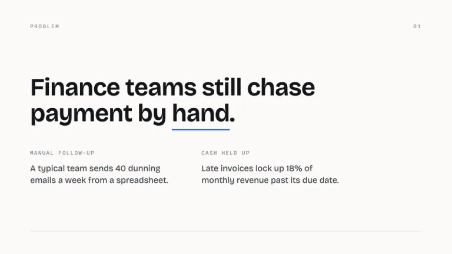
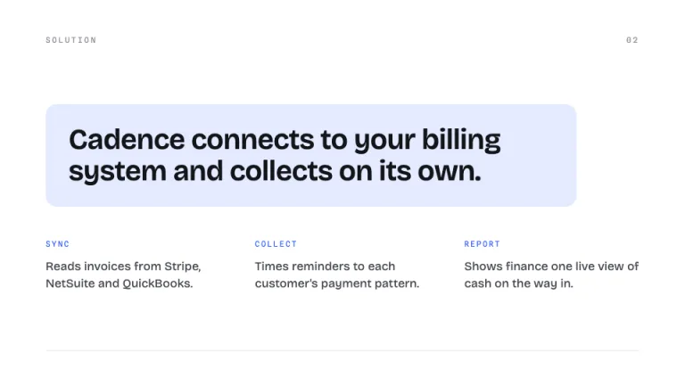
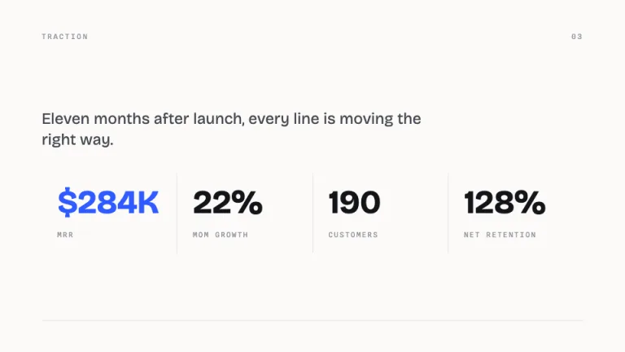
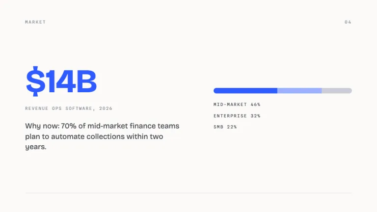
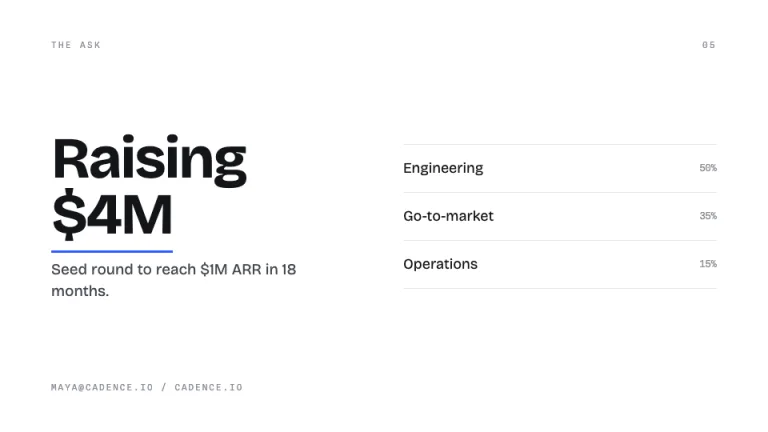

[← All prompts](../README.md) · [Live site](https://slidespeak.co/slide-design-prompts) · [SlideSpeak](https://slidespeak.co)

# Runway

> Clean, light investor pitch deck

The airy minimalist pitch deck with generous margins and one electric-blue accent. Restraint reads as competence in front of investors.

**Category:** Pitch decks &nbsp;·&nbsp; **Style:** Minimal, Corporate &nbsp;·&nbsp; **Mode:** Light &nbsp;·&nbsp; **Fonts:** Bricolage Grotesque + Spline Sans Mono

<table>
    <tr>
      <td align="center" width="33%"><br><sub>Cover</sub></td>
      <td align="center" width="33%"><br><sub>Problem</sub></td>
      <td align="center" width="33%"><br><sub>Solution</sub></td>
    </tr>
    <tr>
      <td align="center" width="33%"><br><sub>Traction</sub></td>
      <td align="center" width="33%"><br><sub>Market</sub></td>
      <td align="center" width="33%"><br><sub>The ask</sub></td>
    </tr>
</table>

## The prompt

Copy the prompt below into **ChatGPT**, **Claude**, or any AI chat — or grab the raw [`PROMPT.md`](./PROMPT.md). It asks what your presentation is about first, then applies the design to every slide.

```text
Create a presentation in the 'Runway' theme: a clean, minimalist pitch deck for a B2B SaaS startup, calm and confident. Background: warm off-white #FBFAF8, with a few slides on pure white #FFFFFF surface for contrast. Typography: headlines in 'Bricolage Grotesque' at 44 to 84px, weight 600 to 700, near-black #14151A, tight tracking around -0.02em; small labels, eyebrows, slide numbers and metric captions in 'Spline Sans Mono' at 10 to 12px, uppercase, letter-spaced 0.18em, muted gray #8A8E99. Both are Google Fonts. Body copy sits at 16 to 20px in #44474F. Layout: lots of white space, wide consistent margins, content aligned to a left axis, one idea per slide. Accents: reserve blue #2F5BFF for a single emphasis per slide, a key number, a 2px underline rule, or a button-like tag with #FFFFFF text. Use #E5EBFF once as a quiet block behind one element. Draw 1px rules in #E7E4DE to separate sections. Strictly avoid: a second accent color, gradients, drop shadows, photos or icons, dense bullet lists, and cramped margins.

Use this theme for my slides. Ask me what the presentation is about first, then apply the theme to every slide.
```

**[Open ChatGPT ↗](https://chatgpt.com/)** &nbsp;·&nbsp; **[Open Claude ↗](https://claude.ai/new)** &nbsp;·&nbsp; **[Generate a finished deck with SlideSpeak ↗](https://app.slidespeak.co/presentation?utm_source=github&utm_medium=referral&utm_campaign=slide-design-prompts)**

## Palette

| Role | Hex |
| --- | --- |
| Background | `#FBFAF8` |
| Surface / panel | `#FFFFFF` |
| Border | `#E7E4DE` |
| Primary accent | `#2F5BFF` |
| Primary (soft tint) | `#E5EBFF` |
| Text on primary | `#FFFFFF` |
| Heading text | `#14151A` |
| Body text | `#44474F` |
| Muted text | `#8A8E99` |

**Chart series:** `#2F5BFF` `#14151A` `#9BB0FF` `#C9CDD6`

## Fonts

- **Bricolage Grotesque** (heading, Google Fonts)
- **Spline Sans Mono** (supporting, Google Fonts)

---

<sub>Part of [SlideSpeak Slide Design Prompts](../../README.md) · MIT licensed</sub>
