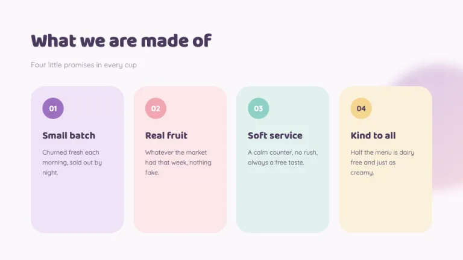
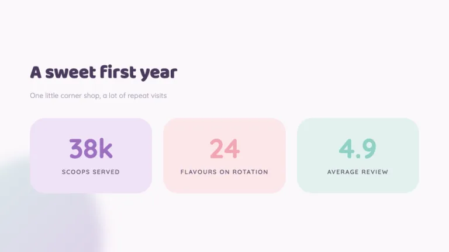
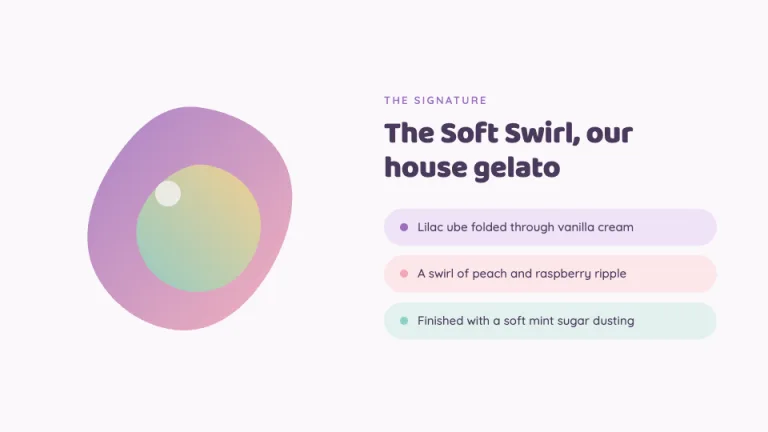
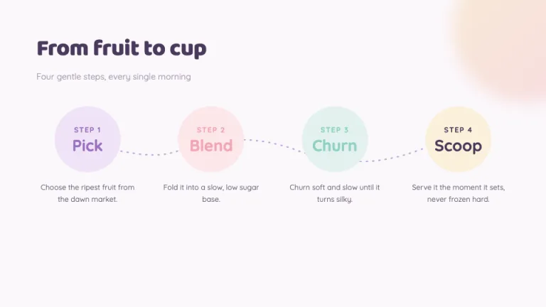
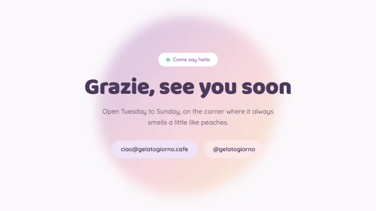

[← All prompts](../README.md) · [Live site](https://slidespeak.co/slide-design-prompts) · [SlideSpeak](https://slidespeak.co)

# Sorbet

> Soft pastels, kept tasteful

A multi-pastel aesthetic deck built on lilac, peach, mint and butter, with rounded Baloo 2 display type and a signature motif of soft gradient blobs and rounded panels. Sweet and airy, never clashing.

**Category:** Marketing & brand &nbsp;·&nbsp; **Style:** Playful, Calm &nbsp;·&nbsp; **Mode:** Light &nbsp;·&nbsp; **Fonts:** Baloo 2 + Quicksand

<table>
    <tr>
      <td align="center" width="33%"><br><sub>Cover</sub></td>
      <td align="center" width="33%"><br><sub>Color-block intro</sub></td>
      <td align="center" width="33%"><br><sub>Stats</sub></td>
    </tr>
    <tr>
      <td align="center" width="33%"><br><sub>Two-column feature</sub></td>
      <td align="center" width="33%"><br><sub>Process</sub></td>
      <td align="center" width="33%"><br><sub>Closing</sub></td>
    </tr>
</table>

## The prompt

Copy the prompt below into **ChatGPT**, **Claude**, or any AI chat — or grab the raw [`PROMPT.md`](./PROMPT.md). It asks what your presentation is about first, then applies the design to every slide.

```text
Create a presentation in the 'Sorbet' theme: a soft pastel aesthetic, the airy Pinterest and TikTok look done with discipline instead of slop. Background: a barely-there lilac wash #FBF7FB on every slide, with content panels in pure white #FFFFFF behind a 1px lilac-tinted border #ECE3F0. Text: deep plum #4A3A5C for headings, soft plum-gray #6A5E76 for body, and pale lilac #A99FB3 for small labels and captions. The signature motif is the rounded blob: large soft shapes built either from gentle border-radius blobs or inline SVG paths, filled with low-saturation linear gradients that drift from lilac #9B6FBF into peach-pink #F2A6B3, and floated behind content as ambient color, often blurred and at reduced opacity so they read as a glow rather than a fill. Everything is rounded: panels at 24 to 32px radius, pills and badges fully rounded, step bubbles as soft circles. The recurring color blocks use the pastel quartet in this exact order, lilac #9B6FBF, peach-pink #F2A6B3, mint #8FD0C4 and butter #F4D58D, applied as soft tints (mix each toward white) for fills and at full strength only for small accents, dots and connectors. Accent discipline: lean on the lilac primary #9B6FBF for the lead color and let the other three pastels rotate through as a balanced set, never more than the four, never at full saturation across a whole panel. Typography: headings (h1 to h6) in 'Baloo 2', a rounded friendly display, at 30 to 64px; body, labels and numbers in 'Quicksand', a rounded geometric sans; both are Google Fonts. Numbers and stats sit big and rounded inside pastel pills or blobs. Keep the air generous and the mood sweet but composed. Strictly avoid: stock photos and clipart, drop shadows, neon or clashing brights, any color outside the lilac, peach, mint and butter set, emoji, dense bullet lists, hard rectangular cards, and harsh outlines.

Use this theme for my slides. Ask me what the presentation is about first, then apply the theme to every slide.
```

**[Open ChatGPT ↗](https://chatgpt.com/)** &nbsp;·&nbsp; **[Open Claude ↗](https://claude.ai/new)** &nbsp;·&nbsp; **[Generate a finished deck with SlideSpeak ↗](https://app.slidespeak.co/presentation?utm_source=github&utm_medium=referral&utm_campaign=slide-design-prompts)**

## Palette

| Role | Hex |
| --- | --- |
| Background | `#FBF7FB` |
| Surface / panel | `#FFFFFF` |
| Border | `#ECE3F0` |
| Primary accent | `#9B6FBF` |
| Primary (soft tint) | `#EFE2F6` |
| Text on primary | `#FFFFFF` |
| Heading text | `#4A3A5C` |
| Body text | `#6A5E76` |
| Muted text | `#A99FB3` |

**Chart series:** `#9B6FBF` `#F2A6B3` `#8FD0C4` `#F4D58D`

## Fonts

- **Baloo 2** (heading, Google Fonts)
- **Quicksand** (supporting, Google Fonts)

---

<sub>Part of [SlideSpeak Slide Design Prompts](../../README.md) · MIT licensed</sub>
