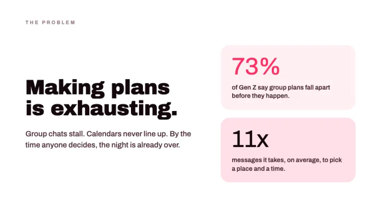
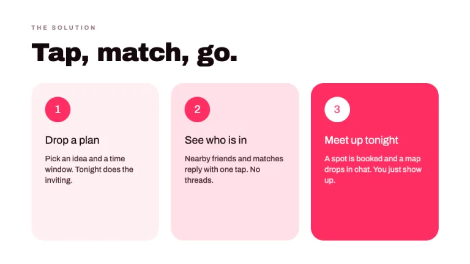
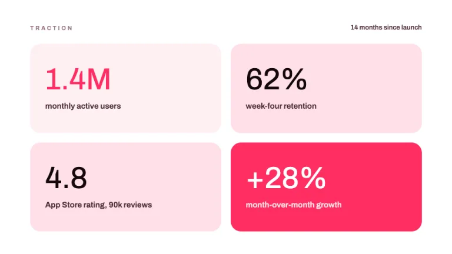
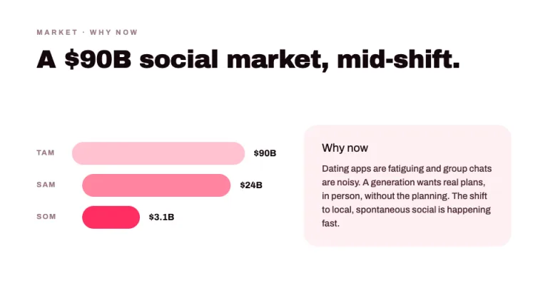
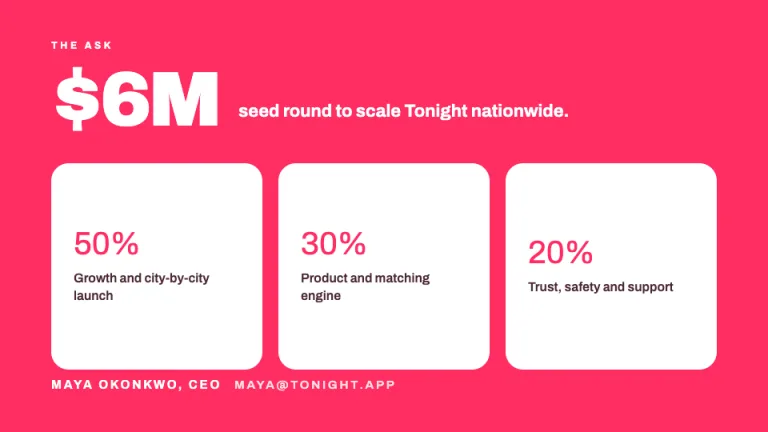

[← All prompts](../README.md) · [Live site](https://slidespeak.co/slide-design-prompts) · [SlideSpeak](https://slidespeak.co)

# Spark

> Bold pink pitch for consumer apps

The high-energy consumer app pitch deck. Heavy display type, vivid pink-red color blocks and oversized numbers built for B2C and social products.

**Category:** Pitch decks &nbsp;·&nbsp; **Style:** Bold, Playful &nbsp;·&nbsp; **Mode:** Light &nbsp;·&nbsp; **Fonts:** Archivo Black + Archivo

<table>
    <tr>
      <td align="center" width="33%"><br><sub>Cover</sub></td>
      <td align="center" width="33%"><br><sub>Problem</sub></td>
      <td align="center" width="33%"><br><sub>Solution</sub></td>
    </tr>
    <tr>
      <td align="center" width="33%"><br><sub>Traction</sub></td>
      <td align="center" width="33%"><br><sub>Market</sub></td>
      <td align="center" width="33%"><br><sub>The ask</sub></td>
    </tr>
</table>

## The prompt

Copy the prompt below into **ChatGPT**, **Claude**, or any AI chat — or grab the raw [`PROMPT.md`](./PROMPT.md). It asks what your presentation is about first, then applies the design to every slide.

```text
Create a presentation in the 'Spark' theme: a bold, playful consumer app pitch deck with high energy. Background: white #FFFFFF on most slides, with full-bleed pink-red #FF2E63 fields on the cover and one or two other slides. Typography: headlines in 'Archivo Black' (a Google Font), heavy and tight, near-black #14080C on white or white #FFFFFF on pink, sized 60 to 100px for covers and 36 to 48px elsewhere; body in 'Archivo' (a Google Font) at 16 to 20px, font-medium to font-bold, color #4A2A33. Layout: left-aligned blocks, big saturated rectangles, plenty of breathing room. Use oversized stat numbers at 48 to 64px in Archivo Black, and round pill and circle shapes built from rounded divs in #FFE0E8 or #FF2E63. Accents: the vivid pink-red #FF2E63 carries the energy as solid blocks, underlines and chart bars, supported by soft pink #FFF0F4 and #FFE0E8 panels. Small labels are uppercase Archivo, letter-spaced, in #9B7B84. Strictly avoid: muted corporate grays, thin light headings, gradients, drop shadows everywhere, stock photos, clip-art icons and cramped text.

Use this theme for my slides. Ask me what the presentation is about first, then apply the theme to every slide.
```

**[Open ChatGPT ↗](https://chatgpt.com/)** &nbsp;·&nbsp; **[Open Claude ↗](https://claude.ai/new)** &nbsp;·&nbsp; **[Generate a finished deck with SlideSpeak ↗](https://app.slidespeak.co/presentation?utm_source=github&utm_medium=referral&utm_campaign=slide-design-prompts)**

## Palette

| Role | Hex |
| --- | --- |
| Background | `#FFFFFF` |
| Surface / panel | `#FFF0F4` |
| Border | `#FFD2DE` |
| Primary accent | `#FF2E63` |
| Primary (soft tint) | `#FFE0E8` |
| Text on primary | `#FFFFFF` |
| Heading text | `#14080C` |
| Body text | `#4A2A33` |
| Muted text | `#9B7B84` |

**Chart series:** `#FF2E63` `#14080C` `#FF85A1` `#FFC2D0`

## Fonts

- **Archivo Black** (heading, Google Fonts)
- **Archivo** (supporting, Google Fonts)

---

<sub>Part of [SlideSpeak Slide Design Prompts](../../README.md) · MIT licensed</sub>
