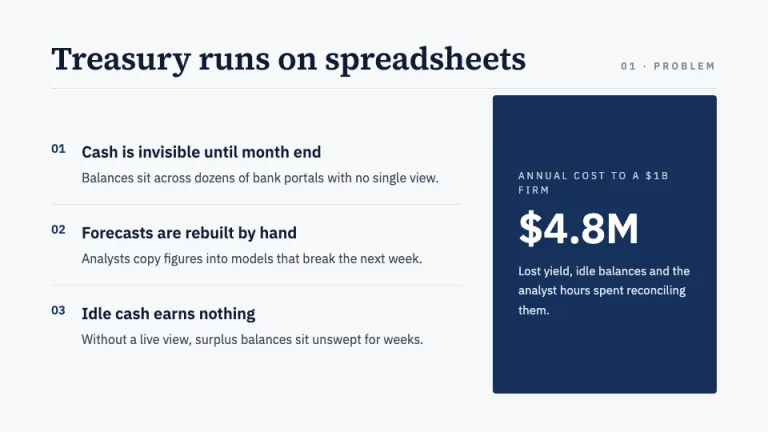
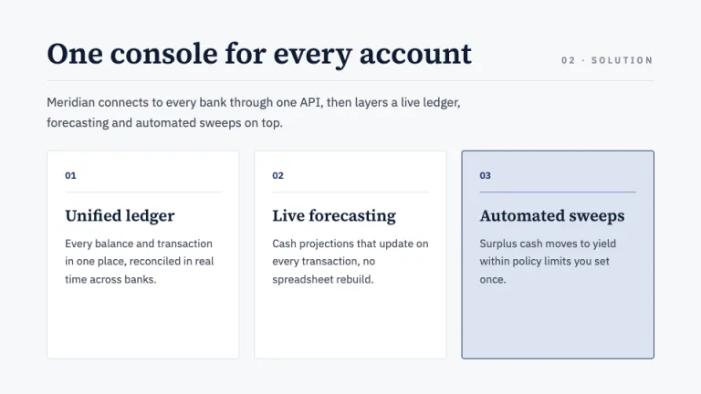
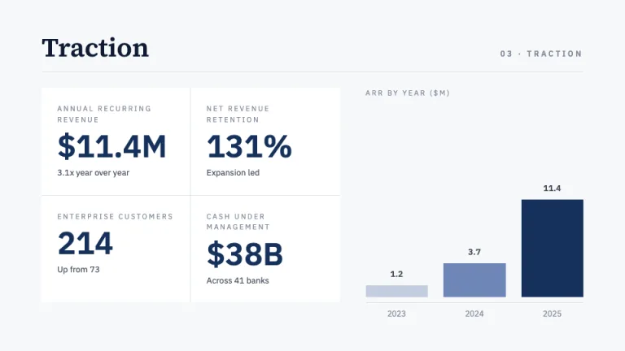
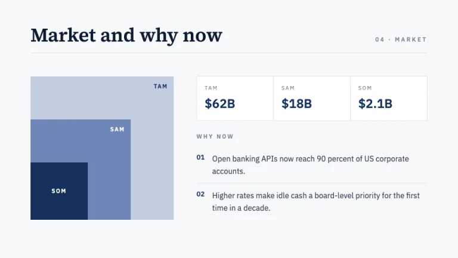
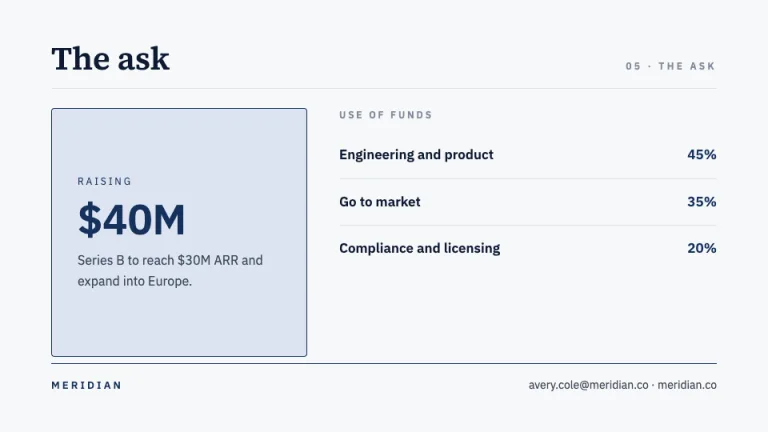

[← All prompts](../README.md) · [Live site](https://slidespeak.co/slide-design-prompts) · [SlideSpeak](https://slidespeak.co)

# Term Sheet

> The institutional VC framework deck

A structured investor pitch deck built to the classic VC template: editorial serif headlines, IBM Plex Sans data in ruled columns, navy ink on cool white. Calm authority for a Series A or B raise.

**Category:** Pitch decks &nbsp;·&nbsp; **Style:** Corporate, Minimal &nbsp;·&nbsp; **Mode:** Light &nbsp;·&nbsp; **Fonts:** Source Serif 4 + IBM Plex Sans

<table>
    <tr>
      <td align="center" width="33%"><br><sub>Cover</sub></td>
      <td align="center" width="33%"><br><sub>Problem</sub></td>
      <td align="center" width="33%"><br><sub>Solution</sub></td>
    </tr>
    <tr>
      <td align="center" width="33%"><br><sub>Traction</sub></td>
      <td align="center" width="33%"><br><sub>Market</sub></td>
      <td align="center" width="33%"><br><sub>The ask</sub></td>
    </tr>
</table>

## The prompt

Copy the prompt below into **ChatGPT**, **Claude**, or any AI chat — or grab the raw [`PROMPT.md`](./PROMPT.md). It asks what your presentation is about first, then applies the design to every slide.

```text
Create a presentation in the 'Term Sheet' theme: a structured, institutional investor pitch deck that reads like the Sequoia pitch deck template, calm authority over flash. Background: flat cool white #F7F8FA on every slide, never a gradient. Typography: headlines in Source Serif 4, 40 to 64px, semibold, navy #0E1B33; section labels and all data in IBM Plex Sans, both Google Fonts. Body runs 16 to 18px in #41495A, labels are 11 to 13px uppercase letterspaced in #818A9C, and every stat number is IBM Plex Sans semibold, 40 to 52px, in navy #16315C. Layout: a visible structured grid with numbered sections, ruled tables and aligned columns built on white #FFFFFF cards with 1px #DDE2EA borders. Accents: navy #16315C carries headings, section numbers, table rules and bar fills only; one panel sits on primarySoft #DCE4F2. Strictly avoid: photos, icons, rounded blob shapes, drop shadows, more than one accent hue, decorative gradients, centered body paragraphs.

Use this theme for my slides. Ask me what the presentation is about first, then apply the theme to every slide.
```

**[Open ChatGPT ↗](https://chatgpt.com/)** &nbsp;·&nbsp; **[Open Claude ↗](https://claude.ai/new)** &nbsp;·&nbsp; **[Generate a finished deck with SlideSpeak ↗](https://app.slidespeak.co/presentation?utm_source=github&utm_medium=referral&utm_campaign=slide-design-prompts)**

## Palette

| Role | Hex |
| --- | --- |
| Background | `#F7F8FA` |
| Surface / panel | `#FFFFFF` |
| Border | `#DDE2EA` |
| Primary accent | `#16315C` |
| Primary (soft tint) | `#DCE4F2` |
| Text on primary | `#FFFFFF` |
| Heading text | `#0E1B33` |
| Body text | `#41495A` |
| Muted text | `#818A9C` |

**Chart series:** `#16315C` `#0E1B33` `#6E86B6` `#C2CDDF`

## Fonts

- **Source Serif 4** (heading, Google Fonts)
- **IBM Plex Sans** (supporting, Google Fonts)

---

<sub>Part of [SlideSpeak Slide Design Prompts](../../README.md) · MIT licensed</sub>
