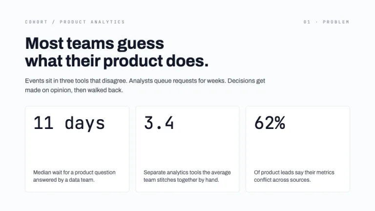
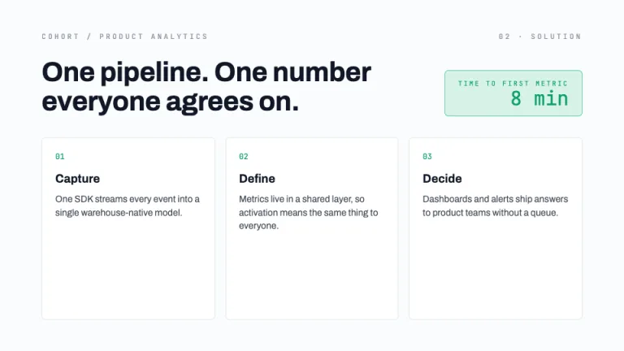
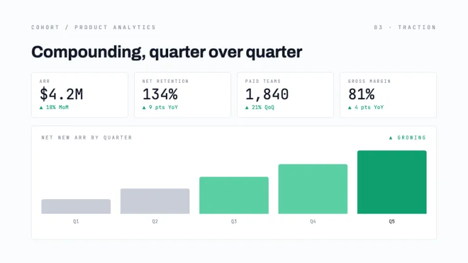
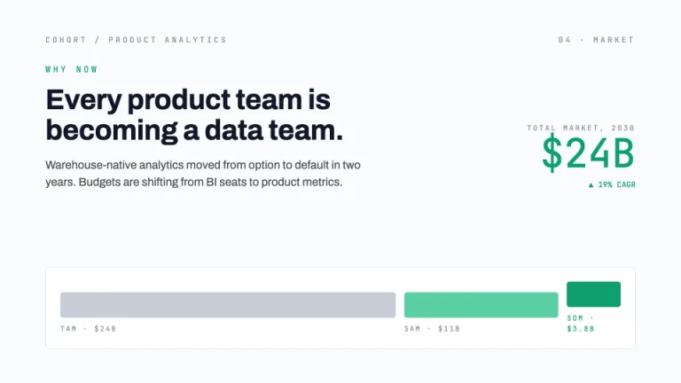
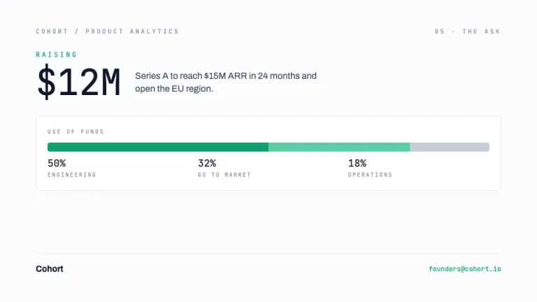

[← All prompts](../README.md) · [Live site](https://slidespeak.co/slide-design-prompts) · [SlideSpeak](https://slidespeak.co)

# Traction

> Let the numbers pitch

A data-forward pitch deck built on white KPI cards, mono numbers and clean CSS charts. Made for growth-stage rounds where the metrics carry the story.

**Category:** Pitch decks &nbsp;·&nbsp; **Style:** Minimal, Tech &nbsp;·&nbsp; **Mode:** Light &nbsp;·&nbsp; **Fonts:** Archivo + JetBrains Mono

<table>
    <tr>
      <td align="center" width="33%"><br><sub>Cover</sub></td>
      <td align="center" width="33%"><br><sub>Problem</sub></td>
      <td align="center" width="33%"><br><sub>Solution</sub></td>
    </tr>
    <tr>
      <td align="center" width="33%"><br><sub>Traction</sub></td>
      <td align="center" width="33%"><br><sub>Market</sub></td>
      <td align="center" width="33%"><br><sub>The ask</sub></td>
    </tr>
</table>

## The prompt

Copy the prompt below into **ChatGPT**, **Claude**, or any AI chat — or grab the raw [`PROMPT.md`](./PROMPT.md). It asks what your presentation is about first, then applies the design to every slide.

```text
Create a presentation in the 'Traction' theme: a clean, light data-driven pitch deck where the numbers do the talking. Background: a calm #FAFBFC that never competes with the data. Typography: 'Archivo' for headlines at 36 to 64px, bold, in near-black #111827, with body copy at 15 to 18px in #3F4754; 'JetBrains Mono' for every number, KPI value, delta, axis label and caption, with big KPI figures at 40 to 56px and tiny mono labels at 10 to 12px in #8A93A2, both Google Fonts. Layout: a tidy dashboard grid of white #FFFFFF KPI cards with 1px #E4E8EC borders and small corner radius, each holding a mono number, a growth delta and a short label, aligned to consistent columns and generous spacing. Accents: reserve data-green #0E9F6E and the lighter #5BD0A4 for growth bars, up-deltas and positive emphasis; use #111827 and #C7CDD6 for neutral series. Strictly avoid: dark backgrounds, gradients, drop shadows, photos, decorative illustrations, rounded chart cartoons, and green on anything that is not a positive number.

Use this theme for my slides. Ask me what the presentation is about first, then apply the theme to every slide.
```

**[Open ChatGPT ↗](https://chatgpt.com/)** &nbsp;·&nbsp; **[Open Claude ↗](https://claude.ai/new)** &nbsp;·&nbsp; **[Generate a finished deck with SlideSpeak ↗](https://app.slidespeak.co/presentation?utm_source=github&utm_medium=referral&utm_campaign=slide-design-prompts)**

## Palette

| Role | Hex |
| --- | --- |
| Background | `#FAFBFC` |
| Surface / panel | `#FFFFFF` |
| Border | `#E4E8EC` |
| Primary accent | `#0E9F6E` |
| Primary (soft tint) | `#D6F2E6` |
| Text on primary | `#FFFFFF` |
| Heading text | `#111827` |
| Body text | `#3F4754` |
| Muted text | `#8A93A2` |

**Chart series:** `#0E9F6E` `#111827` `#5BD0A4` `#C7CDD6`

## Fonts

- **Archivo** (heading, Google Fonts)
- **JetBrains Mono** (supporting, Google Fonts)

---

<sub>Part of [SlideSpeak Slide Design Prompts](../../README.md) · MIT licensed</sub>
