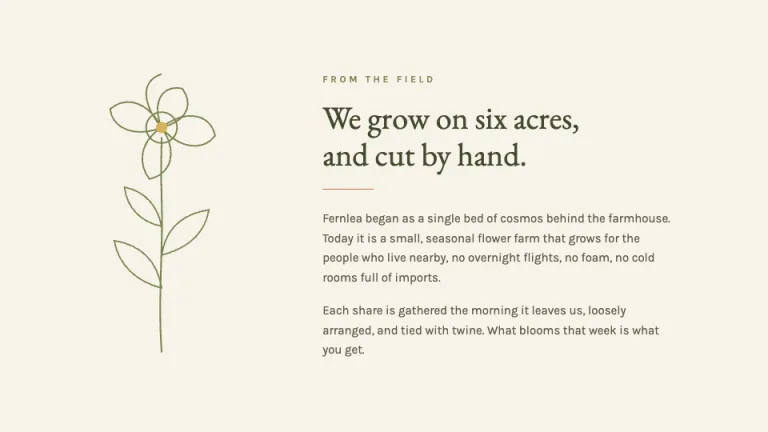
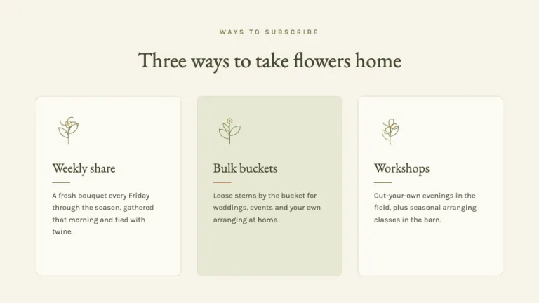
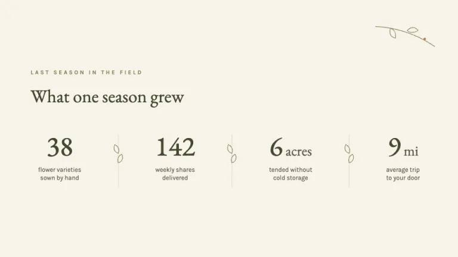
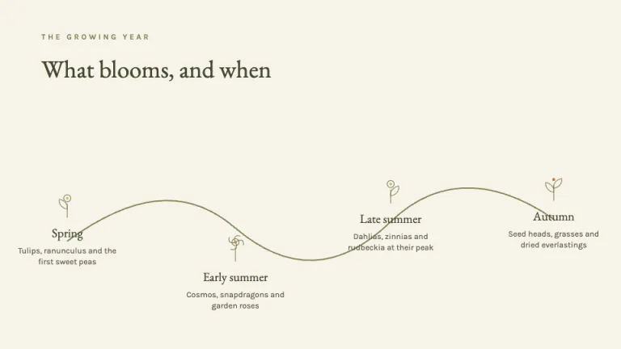
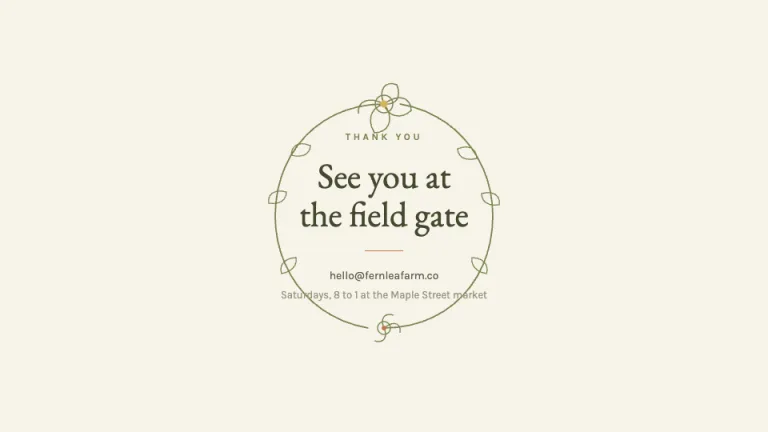

[← All prompts](../README.md) · [Live site](https://slidespeak.co/slide-design-prompts) · [SlideSpeak](https://slidespeak.co)

# Wildflower

> Hand-gathered, loosely arranged

A warm cottagecore deck on cream and sage with butter and terracotta accents, a classic book serif paired with a humanist sans, and a signature motif of hand-drawn line wildflowers, sprigs, leaves and trailing vines.

**Category:** Education & research &nbsp;·&nbsp; **Style:** Warm, Calm &nbsp;·&nbsp; **Mode:** Light &nbsp;·&nbsp; **Fonts:** EB Garamond + Karla

<table>
    <tr>
      <td align="center" width="33%"><br><sub>Cover</sub></td>
      <td align="center" width="33%"><br><sub>Intro</sub></td>
      <td align="center" width="33%"><br><sub>Offerings</sub></td>
    </tr>
    <tr>
      <td align="center" width="33%"><br><sub>Harvest numbers</sub></td>
      <td align="center" width="33%"><br><sub>Seasonal timeline</sub></td>
      <td align="center" width="33%"><br><sub>Closing</sub></td>
    </tr>
</table>

## The prompt

Copy the prompt below into **ChatGPT**, **Claude**, or any AI chat — or grab the raw [`PROMPT.md`](./PROMPT.md). It asks what your presentation is about first, then applies the design to every slide.

```text
Design slides in the 'Wildflower' theme: a warm, hand-gathered cottagecore look, the feeling of a flower-press notebook left open on a kitchen table. Background: warm cream #F6F3E9 on every slide, with cards and panels in lighter cream #FCFAF3 behind thin 1px #E3DECB hairlines, square or barely-rounded corners, never heavy frames. Typography: headings and display lines in the classic book serif 'EB Garamond' in deep olive ink #46492F, body and labels in the humanist sans 'Karla' in soft brown #5E5A48, small captions and meta in muted taupe #9A957E; small uppercase kickers set in sage #7C8450 with wide tracking around 0.22em; both 'EB Garamond' and 'Karla' are Google Fonts. Signature motif: hand-drawn line botanicals built only from inline SVG strokes at roughly 1.5px in sage #7C8450, loose and a little uneven so they read as drawn by hand, never as a clinical pressed-botanical plate; use sprigs and single wildflower stems with five or six rounded petals and a small center, trailing leaves and buds, and a curving vine that can connect points across a slide; flowers may carry the smallest hand-filled center in butter #D9B45B or terracotta #C27A4E. Accent discipline: sage #7C8450 is the lead, used for kickers, vines, leaf strokes, rules and one or two filled chips; terracotta #C27A4E and butter #D9B45B appear only in pinprick doses as a petal center, a tiny node, a single underline; clay #A6896B is the quietest tone for occasional dividers; the four chart colors are sage, terracotta, butter and clay. Keep panels filled with soft sage-cream #E6E8D2 or surface cream, keep the air generous and the line work loose and warm. Strictly avoid: stock or real photos, clipart and emoji, drop shadows, glows or neon, a second loud accent fighting the sage, dense bullet lists, heavy borders, and stiff symmetrical pressed-botanical diagrams that lose the hand-drawn warmth.

Use this theme for my slides. Ask me what the presentation is about first, then apply the theme to every slide.
```

**[Open ChatGPT ↗](https://chatgpt.com/)** &nbsp;·&nbsp; **[Open Claude ↗](https://claude.ai/new)** &nbsp;·&nbsp; **[Generate a finished deck with SlideSpeak ↗](https://app.slidespeak.co/presentation?utm_source=github&utm_medium=referral&utm_campaign=slide-design-prompts)**

## Palette

| Role | Hex |
| --- | --- |
| Background | `#F6F3E9` |
| Surface / panel | `#FCFAF3` |
| Border | `#E3DECB` |
| Primary accent | `#7C8450` |
| Primary (soft tint) | `#E6E8D2` |
| Text on primary | `#FCFAF3` |
| Heading text | `#46492F` |
| Body text | `#5E5A48` |
| Muted text | `#9A957E` |

**Chart series:** `#7C8450` `#C27A4E` `#D9B45B` `#A6896B`

## Fonts

- **EB Garamond** (heading, Google Fonts)
- **Karla** (supporting, Google Fonts)

---

<sub>Part of [SlideSpeak Slide Design Prompts](../../README.md) · MIT licensed</sub>
